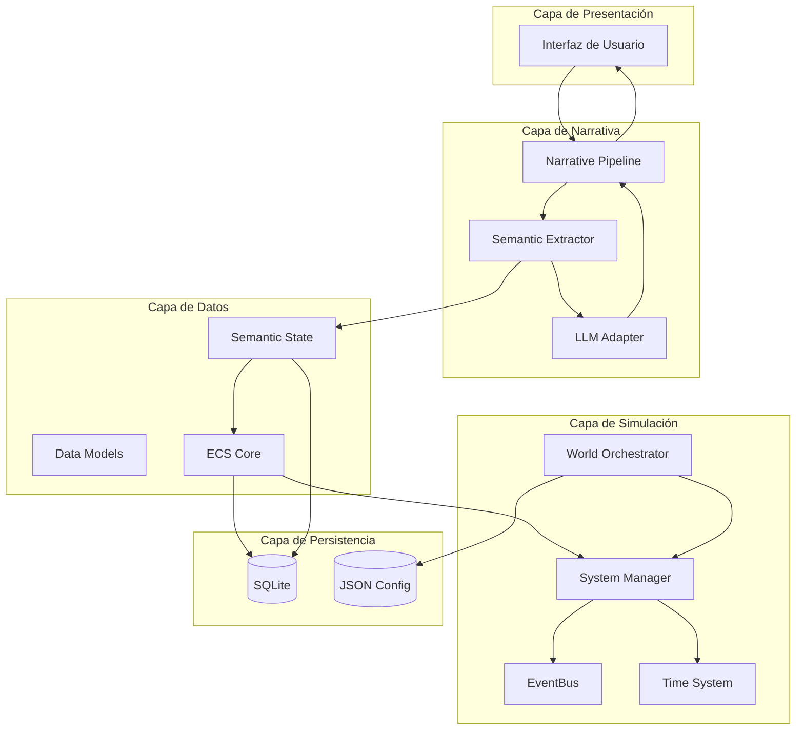

# Aeris — Visión General del Proyecto

**Versión**: 0.3  
**Estado**: Sprint 0 — FROZEN  
**Última actualización**: 2026-07-29

---

## 1. Qué es Aeris

Aeris es un **motor de narrativa emergente** basado en simulación. No es un chatbot. No es un juego con historia lineal. No es un generador de texto con temática Pokémon.

Aeris es un **simulador de mundo** donde:

- Un mundo existe y evoluciona con reglas propias.
- Los personajes son agentes autónomos con estado, memoria, creencias y objetivos.
- La narrativa no se genera directamente: **emerge como consecuencia de la simulación**.
- Un modelo de lenguaje (LLM) interpreta el estado del mundo y lo traduce en narrativa, pero **nunca controla qué sucede**.

## 2. Principios Fundamentales

### Principio 1 — Simulación primero, narrativa después

> La IA nunca decide qué sucede únicamente para producir una escena interesante. Primero simula un mundo coherente; la historia emerge como consecuencia de ese mundo.

El sistema no pregunta "¿qué sería emocionante que ocurriera ahora?". Pregunta "¿qué ocurriría naturalmente dadas las reglas, los personajes y el estado actual del mundo?".

### Principio 2 — Separación absoluta entre simulación y presentación

La UI depende del motor. Nunca al revés. El motor puede funcionar sin interfaz gráfica, sin LLM, sin persistencia. Cada capa es independiente y reemplazable.

### Principio 3 — El LLM es una función, no un controlador

El LLM recibe estado estructurado y produce estado estructurado. Nunca tiene acceso directo al mundo. Nunca muta el World State. Es un traductor, no un director.

### Principio 4 — El mundo existe sin el usuario

El tiempo de simulación avanza independientemente de la interacción. Los personajes actúan, el clima cambia, los eventos ocurren. El usuario es parte del mundo, no su centro.

### Principio 5 — Extensibilidad por diseño

El motor se construye para ser extendido, no modificado. Nuevos componentes, sistemas, reglas biológicas, economías y facciones se añaden sin reescribir el núcleo.

### Principio 6 — Sin optimización prematura

Se diseñará para soportar cientos de entidades activas y miles persistentes. Los límites reales vendrán del perfilado, no de suposiciones.

## 3. Qué NO es Aeris

| No es | Por qué |
|---|---|
| Un chatbot | No responde preguntas sobre el mundo. Simula el mundo y luego narra lo que ocurre. |
| Un juego con guion | No hay historia predeterminada. Todo es emergente. |
| Un generador de texto | El texto es una capa de presentación. El núcleo es un simulador determinista. |
| Un sandbox sin reglas | Todo lo que ocurre tiene causa y consecuencia. Nada ocurre porque sí. |
| Un sistema de roleplay con prompts | Los prompts se construyen desde el estado del mundo, no se escriben manualmente. |

## 4. Arquitectura de Alto Nivel



## 5. Pilares del Sistema

### 5.1 ECS (Entity Component System)

Todo en el sistema es una Entity con Components. Los Systems operan sobre Components. No hay herencia. No hay polimorfismo de objetos. Solo datos y transformaciones.

Ver: `01-ecs-model.md`

### 5.2 Pipeline de Ejecución

Cada tick de simulación sigue un flujo fijo e inmutable. Este pipeline es el corazón temporal del motor.

Ver: `02-execution-contract.md`

### 5.3 Modelos de Datos

Las estructuras de datos son independientes del ECS. Los Components contienen Modelos, no listas crudas.

Ver: `03-data-models.md`

### 5.4 Semantic State

El concepto transversal del proyecto. Es el traductor entre un mundo determinista y un modelo de lenguaje probabilístico.

Ver: `05-semantic-state.md`

### 5.5 Persistencia

SQLite para estado. JSON para configuración y worldbuilding.

Ver: `07-persistence.md`

## 6. Decisiones Clave (resumen)

| Decisión | Estado | ADR |
|---|---|---|
| Paradigma: ECS + DOD | Decidida | ADR-0001 |
| Lenguaje: C# | Decidida | ADR-0003 |
| Librería ECS: Arch | Decidida | ADR-0001 |
| Persistencia: SQLite + JSON | Decidida | ADR-0002 |
| LLM como función pura | Decidida | ADR-0004 |
| Semantic State transversal | Decidida | ADR-0005 |
| Self model reconstruido, no almacenado | Decidida | ADR-0006 |
| Target framework .NET 10 | Decidida | ADR-0007 |
| Afecto funcional, no emociones humanas | Decidida | ADR-0008 |
| Identidad emergente, no componente | Decidida | ADR-0009 |
| Percepción precede a cognición | Decidida | ADR-0010 |
| UI framework | Abierta | — |
| Proveedor LLM | Abierta | — |

## 7. Dependencias del Proyecto

### Dependencias de NuGet (fase inicial)

- **Arch** — ECS ligero y orientado a datos
- **Microsoft.Data.Sqlite** — Persistencia SQLite
- **System.Text.Json** — Serialización JSON (incluido en .NET)

### Dependencias futuras (no definidas aún)

- Framework de UI (MAUI, Avalonia, Godot, terminal)
- Cliente LLM (OpenAI, Claude, Ollama, etc.)

## 8. Estructura de Documentación

```
docs/
├── 00-overview.md              ← Este documento
├── 01-ecs-model.md             ← Modelo ECS formal
├── 02-execution-contract.md    ← Pipeline de ejecución
├── 03-data-models.md           ← Modelos de datos
├── 04-simulation-systems.md    ← Systems, EventBus, Scheduler
├── 05-semantic-state.md        ← Estado narrativo transversal
├── 06-llm-contract.md          ← Contrato con el LLM
├── 07-persistence.md           ← SQLite + JSON
├── 08-narrative-pipeline.md    ← Pipeline narrativo
├── 09-world-model.md           ← Modelo abstracto del mundo
├── 10-engine-invariants.md     ← Reglas inquebrantables
├── 11-extension-points.md      ← Puntos de extensión
├── 12-engine-invariants.md     ← Reglas inquebrantables
├── 14-development-roadmap.md   ← Plan de desarrollo
├── 16-agent-architecture.md    ← Arquitectura del agente
├── 17-computational-agent-model.md ← Modelo computacional formal
├── 18-development-governance.md ← Reglas de gobernanza del desarrollo
├── 99-glossary.md              ← Glosario de términos
├── adr/                        ← Architecture Decision Records
├── contracts/                  ← Contratos formales de subsistemas
├── hypotheses/                 ← Hipótesis de investigación
├── maturity/                   ← Matriz de madurez por subsistema
└── research-notes/             ← Notas de literatura científica

models/                         ← Modelos cognitivos intercambiables
├── ACMA-v1.md                  ← Primer modelo cognitivo experimental
└── experimental/               ← Propuestas y borradores
```

## 9. Capas de Documentación

El proyecto documenta en cuatro dimensiones, más un plano de contratos y un registro de modelos:

| Capa | Formato | Pregunta | Contenido |
|------|---------|----------|-----------|
| Gobernanza | `docs/18-development-governance.md` | ¿Cómo se toman las decisiones? | Pipeline de conocimiento, reglas de admisión |
| Arquitectónica | ADR (`docs/adr/`) | ¿Cómo funciona? | Decisiones vigentes, alternativas, consecuencias |
| Científica | Research Notes (`docs/research-notes/`) | ¿Por qué creemos que es razonable? | Literatura, evidencia, impacto potencial |
| Experimental | Hypotheses (`docs/hypotheses/`) | ¿Qué sigue siendo incierto? | Hipótesis, experimentos, resultados |
| Contratos | Contracts (`docs/contracts/`) | ¿Qué entra y sale de cada subsistema? | Inputs, outputs, invariantes, side effects prohibidos |
| Modelos | Models (`models/`) | ¿Qué teoría cognitiva se ejecuta? | Modelos intercambiables (ACMA v1, v2, etc.) |
| Madurez | Maturity (`docs/maturity/`) | ¿Qué tan maduro está cada subsistema? | Nivel M0-M5 por subsistema |

Cada capa tiene un ciclo de vida distinto y no deben mezclarse. Una Research Note no implica una decisión arquitectónica; una Hypothesis no implica una ADR. La separación permite que el proyecto evolucione sin confundir especulación con decisión.

El ciclo completo de admisión de un nuevo concepto sigue el pipeline definido en `docs/18-development-governance.md`:

---

## 10. Criterio de Completitud del Sprint 0

El Sprint 0 está completo cuando:

1. Cada documento puede ser leído por un desarrollador C# externo y entender el sistema sin preguntas adicionales.
2. Todas las decisiones arquitectónicas están documentadas, ya sea como "decididas" o como "abiertas", indicando explícitamente quién puede resolverlas y en qué momento del proyecto.
3. Cada ADR tiene Alternativas + Consecuencias documentadas y un Estado (Accepted, Proposed, etc.).
4. El Glossario cubre todos los términos usados en los documentos.
5. **No se escribe código**. El objetivo es una especificación técnica completa.
