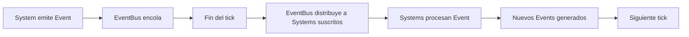
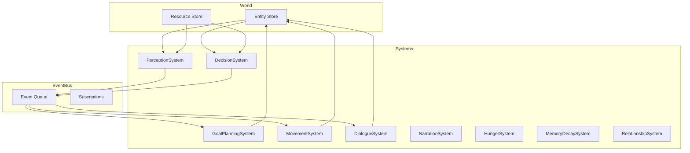
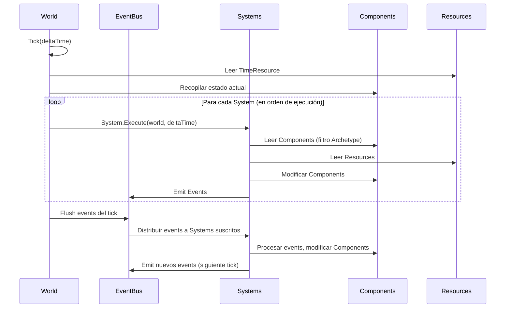
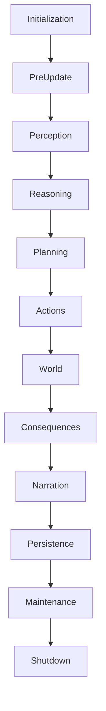
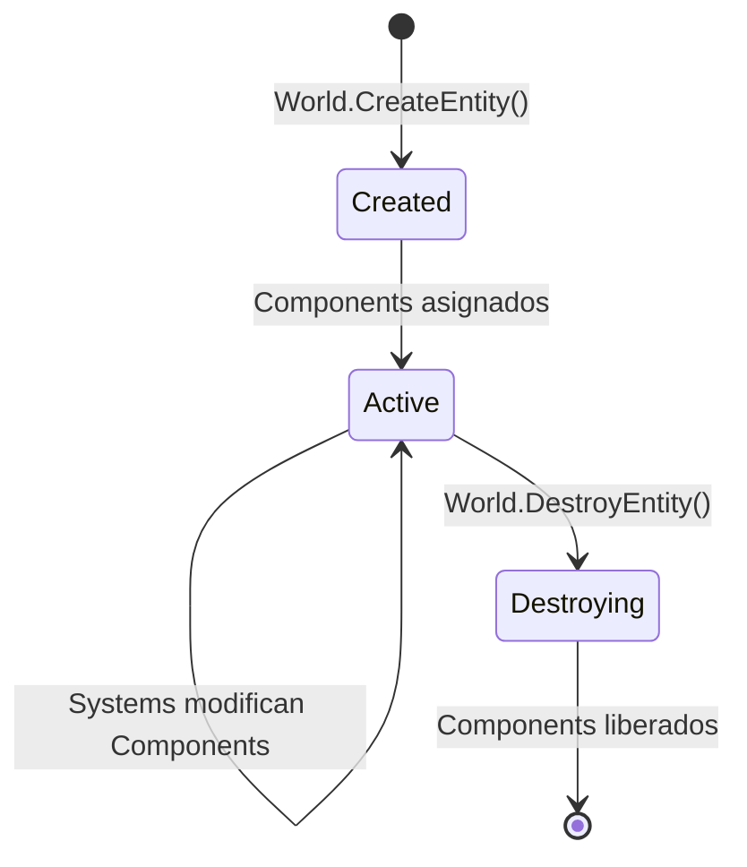

# Modelo ECS Formal

**Versión**: 0.1  
**Estado**: Sprint 0 — Especificación  
**Última actualización**: 2026-07-26  
**ADR relacionado**: [ADR-0001](adr/0001-use-arch-ecs.md)

---

## 1. Definiciones Formales

### 1.1 Entity

Una **Entity** es un identificador único que representa una unidad discreta del mundo. No contiene datos ni lógica. Solo existe.

```csharp
// Una Entity es simplemente un ID
public readonly struct Entity
{
    public readonly uint Id;
    public readonly Arch.World World;

    // Equivalencia por valor
    public bool Equals(Entity other) => Id == other.Id && World == other.World;
    public override int GetHashCode() => HashCode.Combine(Id, World);
}
```

**Reglas**:
- Una Entity solo existe dentro de un World.
- Un World puede contener millones de Entitys (pero el rendimiento práctico será menor).
- Las Entitys no tienen tipo. Su comportamiento viene determinado por los Components que posean.
- Las Entitys se crean y destruyen. No se reutilizan IDs.

**Ejemplo**:
```
Entity: Aeris     (ID: 1)
Entity: Cedrick   (ID: 2)
Entity: Pueblo    (ID: 3)
Entity: Ruta-15   (ID: 4)
Entity: Tormenta  (ID: 5)
```

### 1.2 Component

Un **Component** es un contenedor de datos puros asociado a una Entity. No contiene lógica. No contiene referencias a otros Components. No contiene referencias a Systems.

```csharp
// Un Component es un struct (valor, no referencia)
public struct HealthComponent
{
    public int Current;
    public int Maximum;
    public float RegenerationRate;
}

public struct LocationComponent
{
    public uint RegionId;
    public float X;
    public float Y;
    public float Z;
}
```

**Reglas**:
- Un Component es un `struct` (tipo valor), no un `class` (tipo referencia).
- Un Component contiene **solo datos**. No métodos. No lógica. No validaciones.
- Un Component puede referenciar IDs de otros elementos (otras Entitys, datos externos), pero no objetos vivos.
- Un Component es serializable. Esto es obligatorio para persistencia y debugging.
- Un Component puede ser un modelo de datos anidado (ver `03-data-models.md`).

**Restricción de diseño**:
```csharp
// MAL — Component con lógica
public struct MemoryComponent
{
    public List<Memory> Memories;
    
    public void AddMemory(Memory m)  // ← Prohibido
    {
        Memories.Add(m);
    }
}

// BIEN — Component como datos puros
public struct MemoryComponent
{
    public MemoryGraph Graph;  // Modelo de datos independiente
}
```

### 1.3 System

Un **System** es una transformación que opera sobre Components. Lee Componentes de entidades que cumplan un filtro, aplica lógica, y modifica Componentes como resultado.

```csharp
// Un System es un struct que implementa ISystem
public struct HungerSystem : ISystem
{
    // Filtro: solo entidades con HungerComponent + HealthComponent
    public Archetype Filter { get; } = new(
        typeof(HungerComponent),
        typeof(HealthComponent)
    );

    public void Execute(Arch.World world, float deltaTime)
    {
        foreach (var entity in world.Query(Filter))
        {
            ref var hunger = ref entity.Get<HungerComponent>();
            ref var health = ref entity.Get<HealthComponent>();

            hunger.CurrentValue -= hunger.DecayRate * deltaTime;

            if (hunger.CurrentValue <= 0)
            {
                health.Current -= 1;
                world.Emit(new HealthLostEvent
                {
                    Entity = entity,
                    Amount = 1,
                    Cause = "starvation"
                });
            }
        }
    }
}
```

**Reglas**:
- Un System **lee** Componentes. **Modifica** Componentes. **Emite** Events.
- Un System **nunca** se llama directamente a otro System.
- Un System **nunca** crea o destruye Entitys directamente (emite eventos que otros Systems gestionan).
- Un System **nunca** tiene estado propio (excepto configuración inmutable definida al inicio).
- Un System opera sobre un **conjunto filtrado** de entidades (Archetype).
- Un System recibe `deltaTime` como parámetro. Todo cálculo temporal usa este valor.

**Responsabilidad de un System**: exactamente una responsabilidad. Si un System hace demasiado, se divide en dos.

### 1.4 Event

Un **Event** es un mensaje inmutable que un System emite y que otros Systems reciben. Los Events son la única forma de comunicación entre Systems.

```csharp
// Un Event es un struct inmutable
public readonly struct EntityMovedEvent
{
    public readonly uint EntityId;
    public readonly uint FromRegionId;
    public readonly uint ToRegionId;
}

public readonly struct RelationshipChangedEvent
{
    public readonly uint EntityA;
    public readonly uint EntityB;
    public readonly RelationshipType Type;
    public readonly float PreviousValue;
    public readonly float NewValue;
}
```

**Reglas**:
- Un Event es un `readonly struct`.
- Un Event contiene datos. No contiene lógica.
- Un Event es procesado **solo** por Systems que estén suscritos a ese tipo de evento.
- Los Events se procesan **al final del tick**, no inmediatamente.
- Un System no puede leer el resultado de su propio Event en el mismo tick.

**Ciclo de vida de un Event**:


### 1.5 Resource

Un **Resource** es un dato compartido global que no pertenece a ninguna Entity. Es acceso directo por Systems que lo necesiten.

```csharp
// Un Resource es un struct global
public struct TimeResource
{
    // Tiempo real (double para precisión a largo plazo)
    public double RealTime;
    public float DeltaReal;

    // Escala
    public float TimeScale;

    // Tiempo de simulación (double para precisión a largo plazo)
    public double SimulationTime;
    public float DeltaSimulation;

    // Calendario
    public int CurrentDay;
    public float DayFraction;
    public int CurrentSeason;
    public int CurrentYear;

    // Contador de ticks
    public long Tick;
}

public struct WorldConfigResource
{
    public uint ActiveRegionId;
    public int MaxEntitiesPerRegion;
    public float GlobalDifficulty;
}

public struct RandomResource
{
    public int GlobalSeed;
    public Random GlobalRng;
    public Dictionary<string, Random> SubsystemRngs;
}
```

**Reglas**:
- Un Resource es un `struct`.
- Solo puede existir **una instancia** de cada tipo de Resource en el World.
- Un Resource es accesible directamente por cualquier System.
- Un Resource es serializable.
- Un Resource no tiene ciclo de vida de Entity. Existe mientras el World exista.

**Uso vs. Component**:
| | Component | Resource |
|---|---|---|
| Asociado a | Una Entity | El World |
| Instancias | Múltiples (una por Entity) | Una sola |
| Acceso | Por Entity + filtro | Directo por tipo |
| Ejemplo | `HealthComponent` de Aeris | `TimeResource` global |

---

## 2. Arquitectura ECS del Motor



---

## 3. World

El **World** es el contenedor de todo el estado ECS.

```csharp
public class World : IDisposable
{
    // Entity store
    public Entity CreateEntity();
    public void DestroyEntity(uint entityId);
    public ref T Get<T>(Entity entity) where T : struct;
    public ref T GetOrAdd<T>(Entity entity) where T : struct;

    // Resource store
    public ref T GetResource<T>() where T : struct;
    public void SetResource<T>(T value) where T : struct;

    // Queries
    public IEnumerable<Entity> Query(Archetype archetype);

    // Events
    public void Emit<T>(T evt) where T : struct;

    // Lifecycle
    public void Tick(float deltaTime);
    public void Save(string path);
    public void Load(string path);
}
```

**Reglas del World**:
- Un World es el **único** propietario de Entitys, Components y Resources.
- Un World gestiona el ciclo de vida completo: creación, consulta, modificación, destrucción.
- Un World puede ser serializado y deserializado.
- Un World puede contener múltiples "escenas" o "regiones" como Resources, no como Worlds separados.

---

## 4. Archetype

Un **Archetype** define el conjunto de Component Types que una Entity debe poseer para ser procesada por un System.

```csharp
// Archetype para entidades que pueden tener hambre y salud
var hungryAliveArchetype = new Archetype(
    typeof(HungerComponent),
    typeof(HealthComponent)
);

// Archetype para entidades con memoria y objetivos
var cognitiveArchetype = new Archetype(
    typeof(MemoryComponent),
    typeof(GoalComponent),
    typeof(BeliefComponent),
    typeof(KnowledgeComponent)
);
```

**Reglas de Archetype**:
- Un Archetype es una lista de Types. No contiene datos.
- Un System define su Archetype como parte de su contrato.
- Las Entitys que no cumplan el Archetype son ignoradas por el System.
- Un System puede tener un Archetype vacío (procesa todas las Entitys — usar con cuidado).

---

## 5. Flujo de Datos en un Tick



---

## 6. Sistema de Fases

El orden de ejecución se define por **fases**. Cada fase contiene múltiples Systems. Systems en la misma fase se ejecutan en orden indefinido.

```csharp
// Definición de fases
public static class SystemPhase
{
    public const int Initialization = -100;
    public const int PreUpdate = 0;
    public const int Perception = 100;
    public const int Reasoning = 200;
    public const int Planning = 300;
    public const int Actions = 400;
    public const int World = 500;
    public const int Consequences = 600;
    public const int Narration = 700;
    public const int Persistence = 800;
    public const int Maintenance = 900;
    public const int Shutdown = 1000;
}
```

**Flujo de un tick**:


**Regla**: Cada System declara su fase. Systems en la misma fase se ejecutan en orden indefinido (pueden ejecutarse en paralelo en el futuro).

---

## 7. Ciclo de Vida de una Entity



**Estados**:
- **Created**: Entity existe, sin Components.
- **Active**: Entity tiene al menos un Component. Participa en queries.
- **Destroying**: Entity marcada para destrucción. Se ejecuta al final del tick.

---

## 8. Restricciones del ECS

### 8.1 Separación de responsabilidades

| Entidad | Puede | No puede |
|---|---|---|
| Component | Contener datos | Contener lógica, referenciar Systems |
| System | Leer/escribir Components, emitir Events | Tener estado propio, llamarse entre sí |
| Event | Transportar datos entre Systems | Mutar Components directamente |
| Resource | Almacenar estado global | Asociarse a una Entity |
| Entity | Existir | Contener lógica o datos directamente |

### 8.2 Reglas de acceso

1. Un System solo puede acceder a Components de Entitys que cumplan su Archetype.
2. Un System puede acceder a cualquier Resource.
3. Un System puede emitir cualquier tipo de Event.
4. Un System solo recibe Events de los que esté suscrito.
5. Un System no puede modificar Components de Entitys que no estén en su query.
6. Un System no puede crear o destruir Entitys directamente (solo World lo hace).

### 8.3 Reglas de serialización

1. Todo Component es serializable.
2. Todo Resource es serializable.
3. Un Entity se serializa como su ID + la serialización de sus Components.
4. Un World se serializa como la suma de todas sus Entitys + Resources + la hora de simulación.
5. Los Events no se serializan (son temporales).

---

## 9. Decisiones Abiertas

| Decisión | Estado | Quién resuelve | Cuándo |
|---|---|---|---|
| ¿Arch soporta Archetypes de forma nativa o los implementamos? | Abierta | Sprint 1 (investigación) | Al inicio de la Fase 1 |
| ¿Systems en misma posición se ejecutan en paralelo? | Abierta | Sprint 2 | Después de tener Systems funcionando |
| ¿Cómo se manejan los World splits (múltiples regiones activas)? | Abierta | Sprint 3 | Cuando se implemente el motor de mundo |
