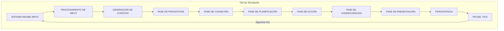
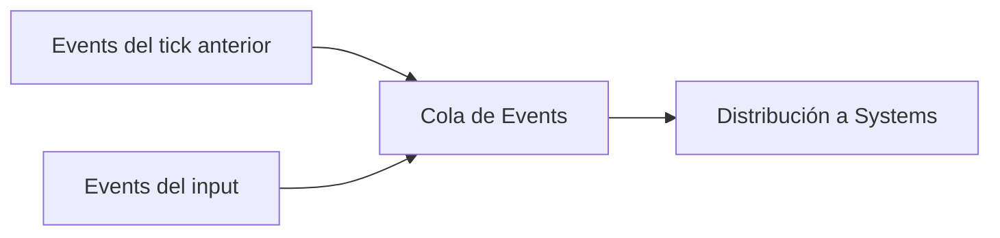
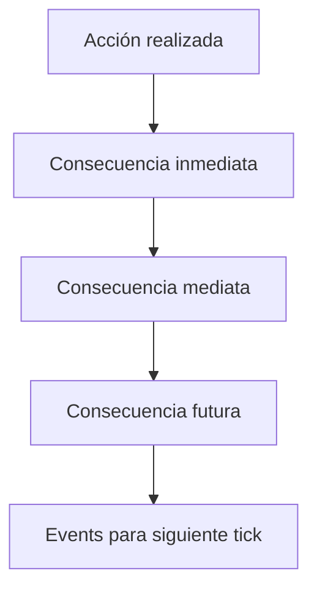

# Contrato de Ejecución

**Versión**: 0.1  
**Estado**: Sprint 0 — Especificación  
**Última actualización**: 2026-07-26

---

## 1. Definición

El **Contrato de Ejecución** define el pipeline fijo e inmutable que cada tick de simulación debe seguir. Este es el contrato más importante del motor: si algo no está en este pipeline, no existe.

---

## 2. El Pipeline



---

## 3. Fases del Pipeline

### 3.1 — Input del Sistema

**Qué ocurre**: El sistema recibe la acción del usuario (o la ausencia de acción).

```csharp
public struct SimulationInput
{
    public uint PlayerEntityId;
    public InputAction? Action;        // null = usuario no hizo nada
    public float RealDeltaTime;        // Tiempo real transcurrido
    public float SimulationDeltaTime;  // Tiempo de simulación transcurrido
}

public struct InputAction
{
    public ActionType Type;
    public uint? TargetEntityId;
    public string? DialogueText;
    public float? DirectionX;
    public float? DirectionY;
}
```

**Tipos de input**:
| Tipo | Descripción |
|---|---|
| `Movement` | El jugador se mueve hacia una dirección |
| `Dialogue` | El jugador habla con una Entity |
| `Inspect` | El jugador examina algo |
| `UseItem` | El jugador usa un objeto |
| `Wait` | El jugador espera (pasa tiempo) |
| `Null` | El usuario no hizo nada (simulación avanza sola) |

### 3.2 — Procesamiento de Input

**Qué ocurre**: El input del usuario se traduce en un evento interno del ECS.

```csharp
// Ejemplo conceptual
if (input.Action is { Type: ActionType.Move, DirectionX: var dx, DirectionY: var dy })
{
    world.Emit(new MovementRequestedEvent
    {
        Entity = input.PlayerEntityId,
        Direction = new Vector2(dx, dy)
    });
}
```

**Regla**: El input del usuario **nunca** modifica Components directamente. Solo emite Events.

### 3.3 — Generación de Eventos

**Qué ocurre**: Se procesan los eventos pendientes del tick anterior y los generados por el input.



**Regla**: No hay distribución inmediata. Todos los Events del tick se acumulan y se distribuyen en la fase correspondiente.

### 3.4 — Fase de Percepción

**Qué ocurre**: Cada System de percepción evalúa qué puede感知ar cada Entity en su entorno actual.

**Systems en esta fase**:
- `PerceptionSystem` — qué ve, oye, huele cada Entity
- `AuraPerceptionSystem` — qué firmas de aura detecta
- `SocialPerceptionSystem` — qué personajes están cerca y cómo interactúan

**Produces**: Events como `EntityObserved`, `AuraDetected`, `ProximityChanged`.

### 3.5 — Fase de Cognición

**Qué ocurre**: Los Systems cognitivos procesan la información percibida y actualizan el estado mental de las Entitys.

**Systems en esta fase**:
- `MemoryConsolidationSystem` — consolida percepciones en memorias
- `KnowledgeUpdateSystem` — actualiza conocimientos basado en nuevas informaciones
- `EmotionProcessingSystem` — procesa triggers emocionales
- `BeliefRevisionSystem` — revisa creencias basado en nueva evidencia

**Produces**: Events como `MemoryCreated`, `BeliefChanged`, `EmotionShifted`.

### 3.6 — Fase de Planificación

**Qué ocurre**: Los Systems de planificación evalúan objetivos, priorizan y generan planes de acción.

**Systems en esta fase**:
- `GoalEvaluationSystem` — evalúa qué objetivos son relevantes ahora
- `DecisionMakingSystem` — elige qué hacer dada la situación
- `PlanningSystem` — genera un plan con pasos concretos

**Produces**: Events como `GoalActivated`, `PlanCreated`, `ActionDecided`.

### 3.7 — Fase de Acción

**Qué ocurre**: Los Systems de acción ejecutan las decisiones tomadas en la fase anterior.

**Systems en esta fase**:
- `MovementSystem` — mueve Entitys en el mundo
- `DialogueSystem` — genera diálogos (usando el LLM)
- `CombatSystem` — resuelve conflictos
- `InventorySystem` — maneja objetos
- `InteractionSystem` — interacciones Entity-Entity

**Produces**: Events como `EntityMoved`, `DialogueGenerated`, `ItemUsed`, `DamageDealt`.

### 3.8 — Fase de Consecuencias

**Qué ocurre**: Se propagan las consecuencias de las acciones realizadas. Cascadas de eventos.



**Systems en esta fase**:
- `RelationshipConsequenceSystem` — actualiza relaciones post-interacción
- `EconomyConsequenceSystem` — impacto económico
- `WorldStateConsequenceSystem` — cambios en el mundo
- `CausalityChainSystem` — genera cadena de causalidad

**Produces**: Events como `RelationshipChanged`, `WorldModified`, `CausalityEvent`.

### 3.9 — Fase de Presentación

**Qué ocurre**: Se construye la representación narrativa del estado del mundo para el usuario.

**Systems en esta fase**:
- `SemanticExtractorSystem` — extrae el Semantic State (ver `05-semantic-state.md`)
- `NarrativeBuilderSystem` — selecciona qué narrar
- `NarrationSystem` — formatea la narración final

**Produces**: La respuesta que el usuario verá.

### 3.10 — Persistencia

**Qué ocurre**: Se guarda el estado del mundo si es necesario.

```csharp
public interface IPersistenceStrategy
{
    bool ShouldSave(WorldState state);
    void Save(WorldState state);
}
```

**Reglas**:
- La persistencia **bloquea** el tick. No puede ser asíncrona en Fase 0.
- Se guarda al final de cada tick si `ShouldSave` retorna `true`.
- La estrategia de cuándo guardar es configurable.

### 3.11 — Fin del Tick

**Qué ocurre**:
1. Se actualiza `TimeResource.SimulationTime`.
2. Se procesan todos los Events acumulados.
3. Se limpian los Components temporales.
4. Se prepara el siguiente tick.

---

## 4. Tiempo de Simulación

### 4.1 Modelo de Tiempo

```csharp
public struct TimeResource
{
    // Tiempo real (double para precisión a largo plazo)
    public double RealTime;
    public float DeltaReal;

    // Escala
    public float TimeScale;

    // Tiempo de simulación (double para precisión a largo plazo)
    public double SimulationTime;
    public float DeltaSimulation;

    // Calendario
    public int CurrentDay;
    public float DayFraction;
    public int CurrentSeason;
    public int CurrentYear;

    // Contador de ticks
    public long Tick;
}
```

### 4.2 Relación Real → Simulación

```csharp
// En cada tick:
simulationDeltaTime = realDeltaTime * timeScale;

// Ejemplos:
// 1x:   1 segundo real = 1 segundo de simulación
// 5x:   1 segundo real = 5 segundos de simulación
// 60x:  1 segundo real = 1 minuto de simulación
// 600x: 1 segundo real = 10 minutos de simulación
```

### 4.3 Regla Fundamental

> **Todo el motor consulta únicamente el tiempo de simulación.** Ningún System conoce el tiempo real excepto el TimeSystem.

Esto permite:
- Acelerar la simulación para pruebas.
- Pausar la simulación sin perder estado.
- Ejecutar el motor headless (sin UI) a cualquier velocidad.

### 4.4 Horas del Día

```csharp
public struct DayCycle
{
    public const double SecondsPerDay = 86400.0; // 24 * 60 * 60
    
    public static float GetHour(double simulationTime)
    {
        double dayFraction = (simulationTime % SecondsPerDay) / SecondsPerDay;
        return (float)(dayFraction * 24.0);
    }
    
    public static bool IsNight(double simulationTime)
    {
        float hour = GetHour(simulationTime);
        return hour < 6f || hour >= 20f;
    }
    
    public static bool IsDawn(double simulationTime)
    {
        float hour = GetHour(simulationTime);
        return hour >= 5f && hour < 7f;
    }
    
    public static bool IsDusk(double simulationTime)
    {
        float hour = GetHour(simulationTime);
        return hour >= 18f && hour < 20f;
    }
}
```

---

## 5. Ciclo de Vida Completo de un Tick

```csharp
public class SimulationEngine
{
    private readonly World _world;
    private readonly EventBus _eventBus;
    private readonly SystemManager _systemManager;
    private readonly IPersistenceStrategy _persistenceStrategy;

    public void Tick(float realDeltaTime)
    {
        ref var time = ref _world.GetResource<TimeResource>();
        ref var scheduler = ref _world.GetResource<SchedulerResource>();

        // 1. Advance EventBus (nextQueue → currentQueue)
        _eventBus.AdvanceTick();

        // 2. Calcular tiempo de simulación
        time.DeltaReal = realDeltaTime;
        time.DeltaSimulation = realDeltaTime * time.TimeScale;
        time.RealTime += realDeltaTime;
        time.SimulationTime += time.DeltaSimulation;
        time.Tick++;

        // 3. Procesar Scheduler (eventos futuros que ya vencieron)
        scheduler.Process(_world, time.SimulationTime);

        // 4. Recibir input
        var input = _inputQueue.DequeueOrDefault();

        // 5. Procesar input → Events
        ProcessInput(input);

        // 6. Ejecutar Systems por fases
        foreach (var phase in SystemPhase.GetAll())
        {
            foreach (var system in _systemManager.GetSystemsInPhase(phase))
            {
                system.Execute(_world, time.DeltaSimulation);
            }
        }

        // 7. Flush deferred events (currentQueue)
        _eventBus.Flush();

        // 8. Persistir si es necesario
        _persistenceStrategy.MaybeSave(_world);

        // 9. Actualizar calendario
        UpdateCalendar(ref time);
    }
}
```

---

## 6. Restricciones del Pipeline

| # | Restricción |
|---|---|
| 1 | El pipeline es **secuencial**. Un tick completo termina antes de que empiece el siguiente. |
| 2 | Los Systems se ejecutan **en el orden definido**. No hay ejecución paralela en Fase 0. |
| 3 | Los Events se procesan **solo al final del tick**, no durante la ejecución de un System. |
| 4 | Ningún System puede **saltarse una fase** del pipeline. |
| 5 | El tiempo de simulación **nunca retrocede**. |
| 6 | El input del usuario se procesa **al inicio** del tick, no durante. |
| 7 | La persistencia ocurre **al final** del tick. |

---

## 7. Decisiones Abiertas

| Decisión | Estado | Quién resuelve | Cuándo |
|---|---|---|---|
| ¿El input se procesa en un tick dedicado o se acumula? | Abierta | Sprint 1 | Al implementar InputSystem |
| ¿Cómo se maneja el input del usuario en modo 600x (mundo acelerado)? | Abierta | Sprint 2 | Cuando se implemente TimeScale |
| ¿El flush de events puede generar un tick recursivo? | Abierta | Sprint 2 | Después de tener el EventBus funcionando |
| ¿La persistencia debe ser asíncrona en fases futuras? | Abierta | Sprint 3+ | Cuando se optimice rendimiento |
