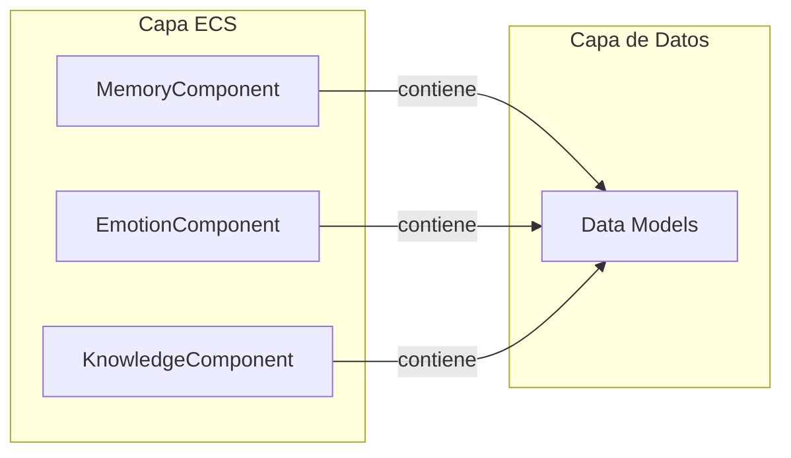

# Modelos de Datos

**Versión**: 0.1  
**Estado**: Sprint 0 — Especificación  
**Última actualización**: 2026-07-26

---

## 1. Principios de Diseño

Los modelos de datos son **estructuras independientes del ECS**. No son Components. Son los tipos de datos que los Components contienen.



**Por qué separar**:
- Reutilización: un mismo modelo puede usarse en múltiples Components.
- Testing: los modelos se pueden probar sin el ECS.
- Serialización: los modelos se serializan independientemente.
- Evolución: cambiar un modelo no rompe el ECS.

---

## 2. Identidad y Existencia

### 2.1 IdentityData

```csharp
public struct IdentityData
{
    public uint EntityId;
    public string Name;                    // Nombre visible
    public string Species;                 // Especie (Pokémon, humano, etc.)
    public EntityType Type;                // Pokémon, humano, location, phenomenon
    public int AgeYears;                   // Edad en años
    public Gender Gender;                  // Macho, hembra, binario, neutro
    public string? Nickname;               // Apodo (opcional)
}

public enum EntityType
{
    Pokemon,
    Human,
    Location,
    Phenomenon,
    Item,
    Faction,
    Ecosystem
}

public enum Gender
{
    Male,
    Female,
    Binary,
    Neutral,
    Unknown
}
```

### 2.2 LocationData

```csharp
public struct LocationData
{
    public uint RegionId;                  // Región contenedora
    public float X;                        // Posición X
    public float Y;                        // Posición Y
    public float Z;                        // Posición Z (para alturas/planos)
    public float FacingAngle;              // Ángulo de dirección en grados
    public LocationType Type;              // Interior, exterior, subterráneo
}

public enum LocationType
{
    Indoor,
    Outdoor,
    Underground,
    Underwater,
    Aerial
}
```

---

## 3. Cuerpo y Salud

### 3.1 HealthData

```csharp
public struct HealthData
{
    public int CurrentHP;
    public int MaxHP;
    public float RegenerationRate;          // HP por segundo de simulación
    public float PoisonTimer;               // 0 = sin veneno, >0 = segundos restantes
    public float BurnTimer;
    public float ParalysisTimer;
    public StatusCondition PrimaryStatus;
}

public enum StatusCondition
{
    None,
    Burned,
    Frozen,
    Paralyzed,
    Poisoned,
    Asleep,
    Confused,
    Fainted
}
```

### 3.2 HungerData

```csharp
public struct HungerData
{
    public float CurrentValue;              // 0 (muerto de hambre) a 100 (lleno)
    public float MaximumValue;
    public float DecayRate;                 // Unidades por hora de simulación
    public float LastAteTime;               // SimulationTime de última comida
}
```

### 3.3 EnergyData

```csharp
public struct EnergyData
{
    public float CurrentValue;              // 0 (exhausto) a 100 (descansado)
    public float MaximumValue;
    public float DecayRate;                 // Unidades por hora
    public float RecoveryRate;              // Al dormir/descansar
    public float SleepDebtAcumulated;       // Horas de sueño perdido
}
```

### 3.4 AuraData

```csharp
public struct AuraData
{
    public AuraSignature Signature;         // Firma única de aura
    public float Intensity;                 // 0 (invisible) a 100 (abrumadora)
    public AuraType Type;                   // Tipo de aura
    public float Range;                     // Alcance de detección
    public List<AuraModifier> Modifiers;    // Modificadores activos
}

public struct AuraSignature
{
    public uint EntityId;
    public float[] Frequencies;             // Firma espectral (8-16 floats)
    public float Amplitude;
    public float Coherence;                 // Qué "pura" es la firma
}

public enum AuraType
{
    Normal,
    TrainerAura,
    Legendary,
    Corrupted,
    Dormant,
    Evolving
}

public struct AuraModifier
{
    public string Source;                   // Qué lo causa
    public float IntensityMultiplier;
    public float DurationRemaining;         // Segundos de simulación
}
```

---

## 4. Cognición

### 4.1 MemoryData

```csharp
public struct MemoryData
{
    public uint MemoryId;                   // ID único
    public MemoryType Type;
    public string Description;              // Descripción textual del evento
    public float EmotionalWeight;           // -1.0 (traumático) a 1.0 (positivo)
    public float Certeza;                   // 0.0 (incierta) a 1.0 (segura)
    public float Importance;                 // 0.0 (trivial) a 1.0 (definitiva)
    public float Timestamp;                 // SimulationTime cuando ocurrió
    public uint? LocationId;                // Dónde ocurrió (null = desconocido)
    public List<uint> InvolvedEntities;     // Quiénes participaron
    public MemoryCategory Category;
    public List<MemoryTag> Tags;            // Etiquetas para búsqueda
}

public enum MemoryType
{
    Observed,       // Lo que vio/escuchó directamente
    Experienced,    // Lo que vivió personalmente
    Learned,        // Lo que alguien le contó
    Inferred,       // Lo que dedujo
    Forgotten       // Se ha degradado significativamente
}

public enum MemoryCategory
{
    Social,         // Interacciones con otros
    Environmental,  // Cambios en el entorno
    Combat,         // Batallas y conflictos
    Discovery,      // Descubrimientos nuevos
    Emotional,      // Eventos con carga emocional fuerte
    Quest           // Objetivos y misiones
}

public enum MemoryTag
{
    Urgent,
    Repeated,
    ContradictsKnown,
    ConfirmsBelief,
    ShakesBelief,
    Personal,
    Public,
    Secret
}
```

### 4.2 BeliefData

```csharp
public struct BeliefData
{
    public uint BeliefId;
    public string Statement;                // Qué cree (texto)
    public float Confidence;                // 0.0 (duda total) a 1.0 (certeza absoluta)
    public BeliefSource Source;
    public float FormationTime;             // Cuándo se formó
    public float LastConfirmationTime;      // Última vez que se confirmó
    public List<uint> SupportingMemories;   // Memorias que lo respaldan
    public List<uint> ContradictingMemories;// Memorias que lo contradicen
    public BeliefStatus Status;
}

public enum BeliefSource
{
    DirectObservation,
    ToldByTrusted,
    ToldByUntrusted,
    CulturalTradition,
    InferredFromEvidence,
    Assumed,
    LLMGenerated          // Creado por el LLM (para testing)
}

public enum BeliefStatus
{
    Active,           // Cree firmemente
    Weakening,        // Empieza a dudar
    Revised,          // Ha cambiado
    Abandoned,        // Ya no cree
    Contradicted      // Sabe que es falso
}
```

### 4.3 KnowledgeData

```csharp
public struct KnowledgeData
{
    public uint KnowledgeId;
    public KnowledgeType Type;
    public string Subject;                  // De qué sabe
    public string Content;                  // Qué sabe
    public KnowledgeCertainty Certainty;
    public KnowledgeSource Source;
    public float AcquisitionTime;
    public float? ExpirationTime;           // null = no expira
    public bool IsPublic;                   // ¿Lo sabe la comunidad?
}

public enum KnowledgeType
{
    Fact,               // Hecho verificable
    Rumor,              // Información no verificada
    Tradition,          // Conocimiento cultural
    Skill,              // Habilidad aprendida
    Location,           // Sabe dónde está algo
    Relationship,       // Sabe sobre una relación
    WorldKnowledge      // Conocimiento general del mundo
}

public enum KnowledgeCertainty
{
    Certain,            // Lo sabe a ciencia cierta
    Probable,           // Cree que es verdad
    Possible,           // Podría ser
    Doubtful,           // Probablemente no
    Impossible          // Sabe que no es verdad
}

public enum KnowledgeSource
{
    DirectExperience,
    Witnessed,
    ToldByAnother,
    Research,
    Inherited,          // Conocimiento cultural/familiar
    Intuited
}
```

### 4.4 GoalData

```csharp
public struct GoalData
{
    public uint GoalId;
    public GoalType Type;
    public string Description;
    public GoalPriority Priority;           // 0.0 (trivial) a 1.0 (vitales)
    public float Urgency;                   // 0.0 (puede esperar) a 1.0 (inmediato)
    public GoalStatus Status;
    public float CreationTime;
    public float? Deadline;                 // null = sin fecha límite
    public List<uint> PrerequisiteGoals;    // Qué debe cumplirse primero
    public List<GoalStep> Steps;            // Pasos para completar
    public uint? AssignedToEntity;          // Quién lo ejecuta
}

public enum GoalType
{
    Survival,           // Comer, dormir, sobrevivir
    Social,             // Relacionarse, ayudar, competir
    Exploration,        // Descubrir, investigar
    Combat,             // Ganar batallas
    Collection,         // Obtener objetos
    Knowledge,          // Aprender, entender
    Emotional,          // Sentimientos personales
    Quest               // Misión específica
}

public enum GoalPriority
{
    Critical = 5,       // Hambre extrema, peligro inmediato
    High = 4,           // Objetivos importantes
    Medium = 3,         // Objetivos estándar
    Low = 2,            // Deseos secundarios
    Trivial = 1         // Curiosidades
}

public enum GoalStatus
{
    Inactive,           // Existe pero no está activo
    Active,             // Siendo perseguido ahora
    Paused,             // Temporalmente detenido
    Completed,          // Logrado
    Failed,             // No se pudo lograr
    Abandoned           // Decidió dejar de perseguirlo
}

public struct GoalStep
{
    public string Description;
    public bool IsCompleted;
    public List<string> RequiredResources;  // Qué necesita
}
```

### 4.5 EmotionData

```csharp
public struct EmotionData
{
    public EmotionType PrimaryEmotion;
    public float Intensity;                 // 0.0 (neutral) a 1.0 (extremo)
    public float DecayRate;                 // Cómo se disipa con el tiempo
    public float FormationTime;             // Cuándo se activó
    public uint? TriggerEntityId;           // Qué lo causó (si aplica)
    public uint? TriggerMemoryId;           // Qué memoria lo causó
    public List<EmotionModifier> Modifiers;
}

public enum EmotionType
{
    // Positivos
    Joy,
    Trust,
    Affection,
    Excitement,
    Pride,
    Relief,
    Gratitude,

    // Negativos
    Fear,
    Anger,
    Sadness,
    Disgust,
    Shame,
    Guilt,
    Jealousy,

    // Neutrales
    Curiosity,
    Surprise,
    Confusion,
    Anticipation,
    Boredom,
    Fatigue,

    // Complejos
    Nostalgia,
    Melancholy,
    Hope,
    Despair,
    Wanderlust,
    Determination,
    Ambivalence
}

public struct EmotionModifier
{
    public string Source;                   // Qué lo modifica
    public float IntensityMultiplier;
    public float DurationRemaining;
}
```

### 4.6 AttentionData

```csharp
public struct AttentionData
{
    public uint? CurrentFocusId;            // Qué está mirando/haciendo ahora
    public float FocusIntensity;            // 0.0 (distraído) a 1.0 (absorbido)
    public List<uint> NearbyEntities;       // Entities en rango de percepción
    public float PerceptualRange;           // Radio de percepción
    public List<AttentionModifier> Modifiers;
}

public struct AttentionModifier
{
    public string Source;
    public float RangeMultiplier;
    public float IntensityMultiplier;
}
```

---

## 5. Social

### 5.1 RelationshipData

```csharp
public struct RelationshipData
{
    public uint EntityA;
    public uint EntityB;
    public RelationshipType Type;
    public float Value;                     // -1.0 (hostil) a 1.0 (aliado)
    public RelationshipStrength Strength;   // Qué fuerte es la relación
    public float TrustLevel;                // 0.0 (desconfianza total) a 1.0 (confianza absoluta)
    public float Familiarity;               // 0.0 (desconocido) a 1.0 (íntimo)
    public float InteractionCount;          // Veces que han interactuado
    public float LastInteractionTime;
    public List<RelationshipEvent> History; // Historial de cambios significativos
    public RelationshipStatus Status;
}

public enum RelationshipType
{
    Neutral,
    Friend,
    Rival,
    Mentor,
    Student,
    Family,
    Romantic,
    Enemy,
    Ally,
    Stranger
}

public enum RelationshipStrength
{
    Acquaintance,       // Se conocen
    Associate,          // Trabajan juntos
    Friend,             // Amigos
    CloseFriend,        // Amigos cercanos
    BestFriend,         // Mejores amigos
    Soulmate            // Conexión profunda
}

public enum RelationshipStatus
{
    Active,
    Dormant,            // Sin interacción reciente
    Strained,           // Bajo estrés
    Broken,             // Roto (enemigos)
    Evolving            // Cambiando de tipo
}

public struct RelationshipEvent
{
    public float Timestamp;
    public string Description;              // Qué ocurrió
    public float ValueChange;               // Cambio en Value
    public float TrustChange;               // Cambio en TrustLevel
}
```

### 5.2 LanguageKnowledgeData

```csharp
public struct LanguageKnowledgeData
{
    public uint LanguageId;                 // Qué idioma
    public float Proficiency;               // 0.0 (nada) a 1.0 (nativo)
    public LanguageType Type;
    public bool CanRead;
    public bool CanWrite;
    public bool CanSpeak;
    public bool CanUnderstand;              // Entiende pero no habla
    public List<string> KnownWords;         // Vocabulario conocido
}

public enum LanguageType
{
    Human,              // Idiomas humanos
    Pokemon,            // Lenguaje Pokémon
    Ancient,            // Idiomas antiguos
    Technical,          // Terminología técnica
    Sign                 // Lenguaje de señas
}
```

---

## 6. Inventario

### 6.1 InventoryItemData

```csharp
public struct InventoryItemData
{
    public uint ItemId;
    public string Name;
    public ItemType Type;
    public float Weight;
    public float Value;                     // Valor económico
    public ItemRarity Rarity;
    public bool IsConsumable;
    public int Quantity;
    public ItemEffect? Effect;              // Efecto al usar
    public uint? OwnerId;                   // Quién lo tiene
    public uint? LocationId;               // Dónde está (si no está en inventario)
    public ItemCondition Condition;
}

public enum ItemType
{
    Medicine,           // Curar
    Pokeball,           // Capturar
    Food,               // Comer
    KeyItem,            // Objeto clave
    Material,           // Material de crafting
    TM,                 // Técnica
    Battle,             // Uso en batalla
    Misc                // Misceláneo
}

public enum ItemRarity
{
    Common,
    Uncommon,
    Rare,
    VeryRare,
    Legendary
}

public enum ItemCondition
{
    Pristine,
    Good,
    Worn,
    Damaged,
    Broken
}

public struct ItemEffect
{
    public EffectType Type;
    public float Magnitude;
    public float Duration;                  // 0 = instantáneo
}

public enum EffectType
{
    HealHP,
    HealStatus,
    RestoreEnergy,
    BoostStat,
    CaptureModifier,
    Damage,
    Buff,
    Debuff
}
```

---

## 7. Mundo

### 7.1 RegionData

```csharp
public struct RegionData
{
    public uint RegionId;
    public string Name;
    public RegionType Type;
    public ClimateData Climate;
    public float Size;                      // Tamaño en unidades del mundo
    public List<uint> ConnectedRegions;     // Regiones conectadas
    public List<uint> Settlements;          // Asentamientos en la región
    public List<uint> Routes;               // Rutas que la atraviesan
    public List<uint> Ecosystems;           // Ecosistemas presentes
    public bool IsDiscovered;               // ¿El jugador la ha descubierto?
    public RegionStatus Status;
}

public enum RegionType
{
    Forest,
    Mountain,
    Plains,
    Desert,
    Swamp,
    Coast,
    Urban,
    Ruins,
    Cave,
    Volcano,
    Tundra,
    Ocean
}

public enum RegionStatus
{
    Normal,
    Affected,           // Bajo efecto de un evento
    Blocked,            // No se puede acceder
    Dangerous,          // Nivel de peligro elevado
    Prosperous          // Nivel alto de recursos
}
```

### 7.2 ClimateData

```csharp
public struct ClimateData
{
    public float Temperature;               // Grados centígrados
    public float Humidity;                  // 0.0 a 1.0
    public float WindSpeed;                 // m/s
    public float WindDirection;             // Grados
    public WeatherType CurrentWeather;
    public WeatherType ForecastWeather;     // Próximo cambio
    public float WeatherChangeTimer;        // Segundos hasta próximo cambio
    public Season CurrentSeason;
}

public enum WeatherType
{
    Clear,
    Cloudy,
    Overcast,
    LightRain,
    HeavyRain,
    Thunderstorm,
    Snow,
    HeavySnow,
    Fog,
    Sandstorm,
    Blizzard,
    Hail,
    Windy,
    Drizzle
}

public enum Season
{
    Spring,
    Summer,
    Autumn,
    Winter
}
```

### 7.3 EcosystemData

```csharp
public struct EcosystemData
{
    public uint EcosystemId;
    public string Name;
    public EcosystemType Type;
    public List<uint> ResidentSpecies;      // Especies que habitan aquí
    public List<uint> MigrantSpecies;       // Especies que pasan temporalmente
    public float Biodiversity;              // 0.0 (muerto) a 1.0 (exuberante)
    public float Health;                    // 0.0 (colapsado) a 1.0 (próspero)
    public List<EcosystemEvent> RecentEvents;
}

public enum EcosystemType
{
    Forest,
    Grassland,
    Wetland,
    Desert,
    Coral,
    Tundra,
    Urban,
    Cave,
    DeepOcean
}

public struct EcosystemEvent
{
    public float Timestamp;
    public string EventType;                // "drought", "bloom", "migration", etc.
    public float Magnitude;
    public List<uint> AffectedSpecies;
}
```

---

## 8. Eventos del Mundo

### 8.1 WorldEventData

```csharp
public struct WorldEventData
{
    public uint EventId;
    public string Name;
    public WorldEventType Type;
    public float StartTime;
    public float? EndTime;                  // null = permanente
    public float Magnitude;                 // 0.0 (menor) a 1.0 (catastrófico)
    public List<uint> AffectedRegions;
    public List<uint> AffectedEntities;
    public List<WorldEventConsequence> Consequences;
    public WorldEventStatus Status;
}

public enum WorldEventType
{
    Natural,            // Clima, terremotos, etc.
    Social,             // Protestas, festivales
    Economic,           // Mercado, escasez
    Political,          // Guerras, tratados
    Ecological,         // Migraciones, plagas
    Legendary,          // Eventos de Pokémon legendarios
    Player              // Causado por el jugador
}

public enum WorldEventStatus
{
    Brewing,            // Está formándose
    Active,             // Está ocurriendo
    Peaking,            // En su punto máximo
    Resolving,          // Se está resolviendo
    Resolved            // Ha terminado
}

public struct WorldEventConsequence
{
    public string Description;
    public float Delay;                     // Segundos antes de activarse
    public float Duration;                  // Cuánto dura
    public List<string> AffectedSystems;    // Qué Systems se impactan
}
```

---

## 9. Componentes ECS (Mapeo)

Los modelos anteriores se usan dentro de Components ECS:

| Component | Modelo(s) de Datos | Descripción |
|---|---|---|
| `IdentityComponent` | `IdentityData` | Identidad de la Entity |
| `LocationComponent` | `LocationData` | Ubicación en el mundo |
| `HealthComponent` | `HealthData` | Salud y estado |
| `HungerComponent` | `HungerData` | Hambre |
| `EnergyComponent` | `EnergyData` | Energía y sueño |
| `AuraComponent` | `AuraData` | Aura y firma |
| `MemoryComponent` | `List<MemoryData>` | Memorias |
| `BeliefComponent` | `List<BeliefData>` | Creencias |
| `KnowledgeComponent` | `List<KnowledgeData>` | Conocimientos |
| `GoalComponent` | `List<GoalData>` | Objetivos activos |
| `EmotionComponent` | `List<EmotionData>` | Emociones activas |
| `AttentionComponent` | `AttentionData` | Atención y enfoque |
| `RelationshipComponent` | `List<RelationshipData>` | Relaciones |
| `LanguageComponent` | `List<LanguageKnowledgeData>` | Conocimiento de idiomas |
| `InventoryComponent` | `List<InventoryItemData>` | Inventario |
| `PersonalityComponent` | `PersonalityData` | Personalidad base |
| `ScheduleComponent` | `ScheduleData` | Rutina diaria |
| `DecisionContextComponent` | `DecisionContextData` | Contexto de decisión actual |

---

## 10. Decisiones Abiertas

| Decisión | Estado | Quién resuelve | Cuándo |
|---|---|---|---|
| ¿Los List en Components se serializan directamente o se normalizan? | Abierta | Sprint 1 | Al implementar persistencia |
| ¿Cómo se manejan las referencias entre modelos (Memory → Entity)? | Abierta | Sprint 1 | Al implementar MemorySystem |
| ¿Los Enums se serializan como strings o integers? | Abierta | Sprint 1 | Al configurar serialización |
| ¿PersonalityData necesita ser un modelo completo o se deriva de otros? | Abierta | Sprint 2 | Al implementar EmotionalSystem |
