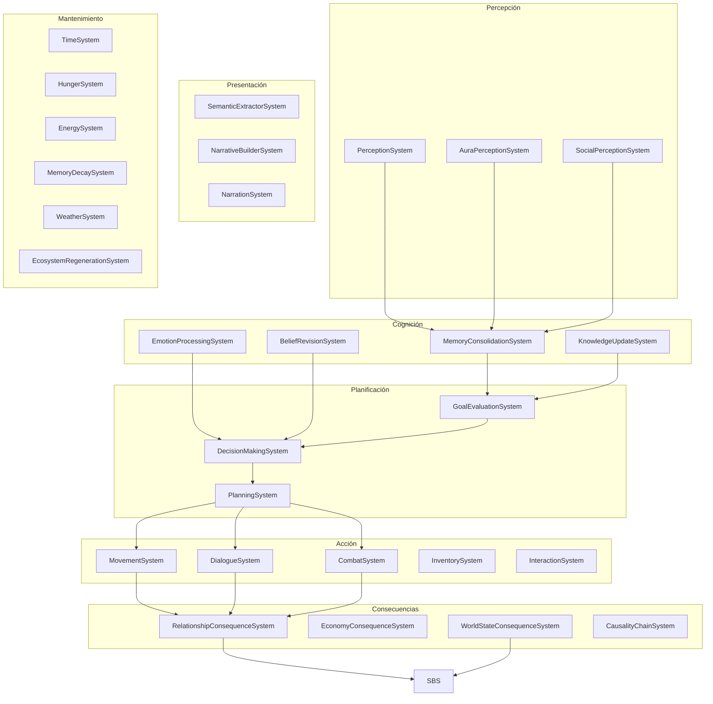
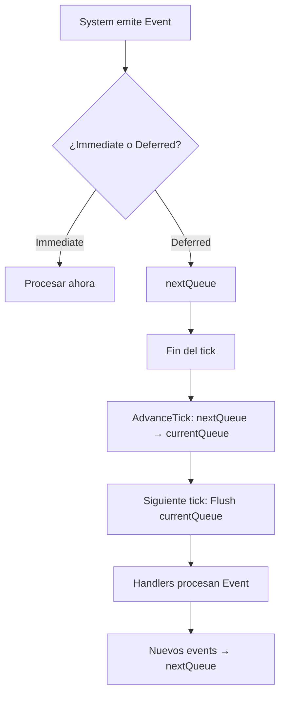

# Sistemas de Simulación

**Versión**: 0.1  
**Estado**: Sprint 0 — Especificación  
**Última actualización**: 2026-07-26

---

## 1. Estructura General

Los **Systems** son las unidades de procesamiento del motor. Cada System tiene una responsabilidad exacta y opera sobre un conjunto definido de Components.



---

## 2. Contrato de un System

La separación entre **metadatos** y **ejecución** es fundamental para escalar.

```csharp
// Descriptor: metadatos del System (se registra una vez)
public class SystemDescriptor
{
    public string Name;
    public int Phase;
    public Archetype ReadFilter;
    public Type[] WriteComponents;
    public Type[] ReadResources;
    public Type[] WriteResources;
    public Type[] SubscribedEvents;
    public Type[] ProducedEvents;
    public bool IsDeterministic;
}

// Interfaz: solo ejecución
public interface ISystem
{
    void Execute(World world, float deltaTime);
    void OnEvent(World world, object evt);
}

// Registro
public class SystemManager
{
    private readonly Dictionary<ISystem, SystemDescriptor> _descriptors;
    
    public void Register(ISystem system, SystemDescriptor descriptor)
    {
        _descriptors[system] = descriptor;
    }
    
    public IEnumerable<ISystem> GetSystemsInPhase(int phase)
    {
        return _descriptors
            .Where(kv => kv.Value.Phase == phase)
            .Select(kv => kv.Key);
    }
}
```

**Regla**: El descriptor se registra una vez al inicio. El System solo ejecuta lógica. Esto permite inspección, validación automática, y herramientas de desarrollo.

---

## 3. Systems de Percepción

### 3.1 PerceptionSystem

**Responsabilidad**: Evaluar qué puede percibir cada Entity en su entorno inmediato.

```csharp
[Order(SystemPhase.Perception)]
public struct PerceptionSystem : ISystem
{
    public Archetype ReadFilter => new(
        typeof(LocationComponent),
        typeof(AttentionComponent),
        typeof(AuraComponent)
    );

    public void Execute(World world, float deltaTime)
    {
        foreach (var entity in world.Query(ReadFilter))
        {
            ref var location = ref entity.Get<LocationComponent>();
            ref var attention = ref entity.Get<AttentionComponent>();
            ref var aura = ref entity.Get<AuraComponent>();

            // Encontrar todas las entities en rango
            var nearbyEntities = world.QueryNearby(
                location.RegionId,
                location.X, location.Y,
                attention.PerceptualRange
            );

            // Actualizar lista de entities cercanas
            attention.NearbyEntities = nearbyEntities
                .Where(e => e != entity)
                .Select(e => e.Id)
                .ToList();

            // Emitir eventos de percepción
            foreach (var nearbyId in attention.NearbyEntities)
            {
                world.Emit(new EntityPerceivedEvent
                {
                    ObserverId = entity.Id,
                    ObservedId = nearbyId,
                    Distance = CalculateDistance(location, nearbyLocation),
                    PerceptionType = GetPerceptionType(aura, nearbyAura)
                });
            }
        }
    }
}
```

**Events producidos**: `EntityPerceivedEvent`, `ProximityChangedEvent`

### 3.2 AuraPerceptionSystem

**Responsabilidad**: Detectar firmas de aura en el entorno.

```csharp
[Order(SystemPhase.Perception, priority: 1)]
public struct AuraPerceptionSystem : ISystem
{
    public Archetype ReadFilter => new(
        typeof(AuraComponent),
        typeof(AttentionComponent),
        typeof(LocationComponent)
    );

    public void Execute(World world, float deltaTime)
    {
        foreach (var entity in world.Query(ReadFilter))
        {
            ref var aura = ref entity.Get<AuraComponent>();
            ref var attention = ref entity.Get<AttentionComponent>();
            
            // Escanear entities cercanas con aura
            foreach (var nearbyId in attention.NearbyEntities)
            {
                var nearby = world.GetEntity(nearbyId);
                if (!nearby.Has<AuraComponent>()) continue;
                
                ref var nearbyAura = ref nearby.Get<AuraComponent>();
                
                // Comparar firmas
                float resonance = AuraUtils.CalculateResonance(
                    aura.Signature,
                    nearbyAura.Signature
                );

                if (resonance > aura.Range)
                {
                    world.Emit(new AuraDetectedEvent
                    {
                        DetectorId = entity.Id,
                        DetectedId = nearbyId,
                        Resonance = resonance,
                        DetectionType = ClassifyDetection(nearbyAura.Type)
                    });
                }
            }
        }
    }
}
```

**Events producidos**: `AuraDetectedEvent`

### 3.3 SocialPerceptionSystem

**Responsabilidad**: Evaluar el estado social de las interacciones cercanas.

**Events producidos**: `SocialContextChangedEvent`, `MoodObservedEvent`

---

## 4. Systems de Cognición

### 4.1 MemoryConsolidationSystem

**Responsabilidad**: Convertir percepciones recientes en memorias consolidadas.

```csharp
[Order(SystemPhase.Cognition, priority: 10)]
public struct MemoryConsolidationSystem : ISystem
{
    public Archetype ReadFilter => new(
        typeof(MemoryComponent),
        typeof(EmotionComponent),
        typeof(AttentionComponent)
    );

    public Type[] SubscribedEvents => new[]
    {
        typeof(EntityPerceivedEvent),
        typeof(AuraDetectedEvent),
        typeof(DialogueGeneratedEvent),
        typeof(CombatResolvedEvent),
        typeof(WorldEventStartedEvent)
    };

    public void Execute(World world, float deltaTime)
    {
        foreach (var entity in world.Query(ReadFilter))
        {
            ref var memory = ref entity.Get<MemoryComponent>();
            ref var emotion = ref entity.Get<EmotionComponent>();
            ref var attention = ref entity.Get<AttentionComponent>();

            // Consolidar percepciones recientes en memorias
            var recentPerceptions = GetRecentPerceptions(entity, deltaTime);
            
            foreach (var perception in recentPerceptions)
            {
                // Evaluar importancia
                float importance = CalculateImportance(
                    perception,
                    emotion.PrimaryEmotion,
                    attention.CurrentFocusId
                );

                // Crear memoria si es suficientemente importante
                if (importance > IMPORTANCE_THRESHOLD)
                {
                    var newMemory = new MemoryData
                    {
                        MemoryId = world.GenerateId(),
                        Type = ClassifyMemoryType(perception),
                        Description = perception.Description,
                        EmotionalWeight = CalculateEmotionalWeight(perception, emotion),
                        Certainty = perception.Certainty,
                        Importance = importance,
                        Timestamp = world.GetResource<TimeResource>().SimulationTime,
                        LocationId = entity.Get<LocationComponent>().RegionId,
                        InvolvedEntities = perception.InvolvedEntities,
                        Category = ClassifyCategory(perception),
                        Tags = GenerateTags(perception)
                    };

                    memory.Graph.AddMemory(newMemory);
                    
                    world.Emit(new MemoryCreatedEvent
                    {
                        EntityId = entity.Id,
                        Memory = newMemory
                    });
                }
            }

            // Decaying de memorias antiguas
            DecayMemories(ref memory, deltaTime);
        }
    }
}
```

**Events producidos**: `MemoryCreatedEvent`, `MemoryDecayedEvent`

### 4.2 KnowledgeUpdateSystem

**Responsabilidad**: Actualizar conocimientos basado en nuevas memorias y evidencia.

**Events producidos**: `KnowledgeAcquiredEvent`, `KnowledgeRevokedEvent`

### 4.3 EmotionProcessingSystem

**Responsabilidad**: Procesar triggers emocionales y actualizar estado emocional.

```csharp
[Order(SystemPhase.Cognition, priority: 20)]
public struct EmotionProcessingSystem : ISystem
{
    public Archetype ReadFilter => new(
        typeof(HungerComponent),
        typeof(HealthComponent)
    );

    public void Execute(World world, float deltaTime)
    {
        foreach (var entity in world.Query(ReadFilter))
        {
            ref var hunger = ref entity.Get<HungerComponent>();
            ref var health = ref entity.Get<HealthComponent>();
            
            hunger.CurrentValue -= hunger.DecayRate * deltaTime;
            hunger.CurrentValue = Math.Max(hunger.CurrentValue, 0);
            
            if (hunger.CurrentValue <= 0 && health.CurrentHP > 0)
            {
                // Aplicar daño por hambre
                health.CurrentHP -= 1;
                
                world.Emit(new HealthLostEvent
                {
                    EntityId = entity.Id,
                    Amount = 1,
                    Cause = "starvation"
                });
            }
        }
    }
}
```

### 8.3 EnergySystem

**Responsabilidad**: Actualizar nivel de energía y manejar sueño.

### 8.4 MemoryDecaySystem

**Responsabilidad**: Degradar memorias antiguas y olvidar las menos importantes.

### 8.5 WeatherSystem

**Responsabilidad**: Simular cambios de clima y clima.

### 8.6 EcosystemRegenerationSystem

**Responsabilidad**: Regenerar ecosistemas dañados, manejar ciclos naturales.

---

## 9. EventBus

### 9.1 Tipos de Eventos

```csharp
public enum EventType
{
    Deferred,   // Se procesa en el siguiente tick (predeterminado)
    Immediate   // Se procesa inmediatamente (solo para errores fatales)
}

public readonly struct EventMetadata
{
    public readonly Type EventType;
    public readonly EventType DispatchType;
    public readonly long Tick;
}
```

**Immediate** — Para casos excepcionales: `FatalError`, `EngineShutdown`, `CancelSimulation`. No esperan un tick.

**Deferred** — Todos los demás. Van a la cola del siguiente tick.

### 9.2 Estructura — Modelo de Doble Cola

```csharp
public class EventBus
{
    private readonly Dictionary<Type, List<Action<object>>> _subscribers;
    
    // Cola actual (se procesa en este tick)
    private readonly Queue<EventEntry> _currentQueue;
    
    // Cola siguiente (se procesa en el siguiente tick)
    private readonly Queue<EventEntry> _nextQueue;

    public void Subscribe<T>(Action<T> handler) where T : struct
    {
        var type = typeof(T);
        if (!_subscribers.ContainsKey(type))
            _subscribers[type] = new List<Action<object>>();
        
        _subscribers[type].Add(evt => handler((T)evt));
    }

    public void Emit<T>(T evt, EventType dispatchType = EventType.Deferred) where T : struct
    {
        var entry = new EventEntry
        {
            Data = evt,
            Metadata = new EventMetadata
            {
                EventType = typeof(T),
                DispatchType = dispatchType,
                Tick = _currentTick
            }
        };

        if (dispatchType == EventType.Immediate)
        {
            ProcessImmediate(entry);
        }
        else
        {
            _nextQueue.Enqueue(entry);
        }
    }

    public void AdvanceTick()
    {
        // Mover nextQueue a currentQueue
        (_currentQueue, _nextQueue) = (_nextQueue, _currentQueue);
        _currentQueue.Clear();
    }

    public void Flush()
    {
        while (_currentQueue.Count > 0)
        {
            var entry = _currentQueue.Dequeue();
            
            if (_subscribers.TryGetValue(entry.Metadata.EventType, out var handlers))
            {
                foreach (var handler in handlers)
                    handler(entry.Data);
            }
        }
    }

    private void ProcessImmediate(EventEntry entry)
    {
        if (_subscribers.TryGetValue(entry.Metadata.EventType, out var handlers))
        {
            foreach (var handler in handlers)
                handler(entry.Data);
        }
    }
}
```

### 9.3 Ciclo de Vida de un Event



### 9.4 Reglas del EventBus

1. Events **Deferred** se acumulan en `nextQueue` y se procesan en el siguiente tick.
2. Events **Immediate** se procesan inmediatamente (solo para errores fatales).
3. Un System no puede leer el resultado de su propio Event en el mismo tick.
4. Un System puede emitir múltiples Events por tick.
5. Los Events se procesan en orden FIFO.
6. Events emitidos durante `Flush` van a `nextQueue` (no al `currentQueue` actual).

---

## 10. Scheduler (Resource)

El **Scheduler** es un Resource que permite programar eventos futuros. Vive junto con `TimeResource`, `RandomResource`, y otros Resources globales.

```csharp
public struct SchedulerResource
{
    public SortedList<double, ScheduledEvent> Events;
    
    public void Schedule(double triggerTime, Action<World> callback, string description)
    {
        Events.Add(triggerTime, new ScheduledEvent
        {
            TriggerTime = triggerTime,
            Callback = callback,
            Description = description
        });
    }
    
    public void Process(World world, double currentTime)
    {
        while (Events.Count > 0 && Events.Keys[0] <= currentTime)
        {
            var evt = Events.Values[0];
            Events.RemoveAt(0);
            
            evt.Callback(world);
            
            world.Emit(new ScheduledEventTriggeredEvent
            {
                Description = evt.Description,
                TriggerTime = evt.TriggerTime
            });
        }
    }
}
```

**Ejemplo de uso** (desde un System):
```csharp
// Programar una tormenta en 2 horas de simulación
ref var scheduler = ref world.GetResource<SchedulerResource>();
ref var time = ref world.GetResource<TimeResource>();

scheduler.Schedule(
    time.SimulationTime + 7200.0,
    world => 
    {
        ref var climate = ref world.GetResource<ClimateResource>();
        climate.CurrentWeather = WeatherType.Thunderstorm;
    },
    "Thunderstorm begins"
);
```

---

## 11. Decisiones Abiertas

| Decisión | Estado | Quién resuelve | Cuándo |
|---|---|---|---|
| ¿Cómo se manejan los Systems que fallan (excepciones)? | Abierta | Sprint 1 | Al implementar SystemManager |
| ¿El EventBus soporta prioridad de eventos? | Abierta | Sprint 2 | Después de tener eventos funcionando |
| ¿El Scheduler es parte del World o un Resource? | Abierta | Sprint 1 | Al implementar Scheduler |
| ¿Cómo se prueban Systems aislados? | Abierta | Sprint 1 | Al escribir primeros tests |
