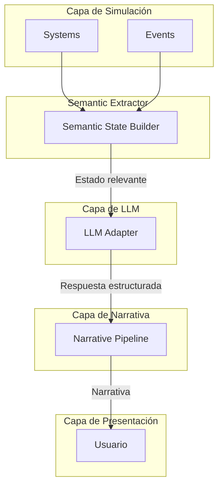
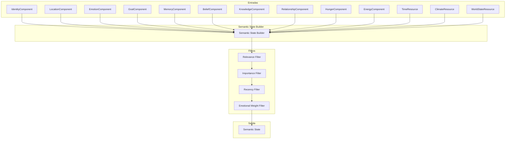

# Semantic State — Estado Narrativo Transversal

**Versión**: 0.1  
**Estado**: Sprint 0 — FROZEN  
**Última actualización**: 2026-07-26  
**ADR relacionado**: [ADR-0005](adr/0005-semantic-state-as-transversal.md)

---

## 1. Qué es el Semantic State

El **Semantic State** no es memoria. No es conocimiento. No es emoción. No es un Component.

El Semantic State es **el subconjunto del estado del mundo que el LLM necesita para producir narrativa**. Es un traductor entre un simulador determinista y un modelo de lenguaje probabilístico.

```mermaid
graph LR
    subgraph "Mundo Determinista"
        ECS[Estado ECS Completo]
        MEM[Memorias]
        BEL[Creencias]
        EMO[Emociones]
        GOAL[Objetivos]
        REL[Relaciones]
        WORLD[Estado del Mundo]
    end

    subgraph "Semantic Extractor"
        SE[Semantic Extractor]
    end

    subgraph "Subconjunto Relevante"
        SS[Semantic State]
    end

    subgraph "Prompt Builder"
        PB[Prompt Builder]
    end

    subgraph "LLM"
        LLM[Modelo de Lenguaje]
    end

    subgraph "Resultado"
        NAR[Narrativa]
        THOUGHT[Pensamientos]
        DIAL[Diálogo]
        ACTION[Acciones]
    end

    ECS --> SE
    MEM --> SE
    BEL --> SE
    EMO --> SE
    GOAL --> SE
    REL --> SE
    WORLD --> SE
    SE --> SS
    SS --> PB
    PB --> LLM
    LLM --> NAR
    LLM --> THOUGHT
    LLM --> DIAL
    LLM --> ACTION
```

### 1.1 Analogía

Piensa en el Semantic State como una **hoja de personaje** que un director de teatro prepara para un actor antes de una escena:

- No le da todo el guion (eso sería demasiado).
- No le da solo una línea (eso sería insuficiente).
- Le da: quién es, qué quiere, qué sabe, qué siente, dónde está, y qué acaba de pasar.

Eso es el Semantic State.

---

## 2. Por qué es Transversal

El Semantic State no es un módulo aislado. **Todo el proyecto gira alrededor de él**.



El Semantic State es:
1. **El producto principal** de la fase de presentación del pipeline.
2. **La entrada principal** del LLM.
3. **El resultado** de consolidar todo lo que los Systems han producido.
4. **El puente** entre determinismo y probabilismo.

---

## 3. Estructura del Semantic State

```csharp
public struct SemanticState
{
    // === IDENTIDAD ===
    public EntityIdentity Identity;        // Quién soy
    
    // === SITUACIÓN ACTUAL ===
    public CurrentSituation Situation;     // Dónde estoy, qué pasa ahora
    
    // === ESTADO INTERNO ===
    public InternalState Internal;         // Qué siento, qué quiero, qué me preocupa
    
    // === CONTEXTO SOCIAL ===
    public SocialContext Social;            // Con quién estoy, qué关系 tengo
    
    // === MEMORIA RELEVANTE ===
    public RelevantMemory Memory;          // Qué recuerdo que importa ahora
    
    // === CONOCIMIENTO ===
    public RelevantKnowledge Knowledge;    // Qué sé que es relevante
    
    // === INSTRUCCIONES DEL NARRADOR ===
    public NarratorDirectives Directives;  // Qué debo/narrar, qué no debo
}

public struct EntityIdentity
{
    public string Name;
    public string Species;
    public int AgeYears;
    public string Personality;              // Descripción textual de la personalidad
    public string Role;                     // "Entrenador Pokémon", "Ciudadano", etc.
}

public struct CurrentSituation
{
    public string Location;                 // "Ruta 15, borde del bosque"
    public string TimeOfDay;                // "atardecer", "noche", "amanecer"
    public string Weather;                  // "lluvia ligera", "nublado"
    public string Season;                   // "otoño"
    public List<string> NearbyEntities;     // "Cedrick (entrenador, aliado)"
    public string CurrentActivity;          // "caminando hacia el pueblo"
    public string RecentEvent;              // "acaba de llover"
}

public struct InternalState
{
    public string PrimaryEmotion;           // "ansiedad moderada"
    public string EmotionalReason;          // "porque no sabe si puede confiar en Cedrick"
    public string CurrentGoal;              // "investigar las ruinas al norte"
    public string GoalUrgency;              // "moderada, puede esperar"
    public string BiggestWorry;             // "que la lluvia aumente y bloqueen la ruta"
    public string PhysicalState;            // "cansada, con algo de hambre"
    public string MentalState;              // "determinada pero cautelosa"
}

public struct SocialContext
{
    public List<SocialRelationship> Relationships;
    public string CurrentSocialSituation;  // "está con Cedrick, quien le ofreció ayuda"
    public string SocialTension;            // "no está segura si aceptar su ayuda"
}

public struct SocialRelationship
{
    public string Name;
    public string Type;                     // "aliado potencial"
    public string TrustLevel;               // "parcial, ganándose poco a poco"
    public string RecentInteraction;        // "Cedrick le ofreció guiarla a la ruina"
    public string CurrentFeeling;           // "cautela mezclada con curiosidad"
}

public struct RelevantMemory
{
    public List<RelevantMemoryEntry> Memories;
    public string RecurringThought;         // "no puede dejar de pensar en lo que dijo el anciano"
}

public struct RelevantMemoryEntry
{
    public string Description;              // "El anciano del pueblo le advirtió sobre las ruinas"
    public string EmotionalImpact;          // "le generó miedo y curiosidad a la vez"
    public string Certeza;                  // "el anciano parecía serio"
    public string RelevanceToNow;           // "justo ahora está frente a la entrada a la ruina"
}

public struct RelevantKnowledge
{
    public List<KnowledgeEntry> Knowledge;
    public string KeyBelief;                // "cree que las ruinas contienen algo importante"
    public string Uncertainty;              // "no sabe qué tan peligroso es entrar"
}

public struct KnowledgeEntry
{
    public string What;                     // "Los Pokémon de la zona evitan la ruina"
    public string Certainty;                // "lo vio personally"
    public string Source;                   // "observación directa"
}

public struct NarratorDirectives
{
    public List<string> MustInclude;        // Qué elementos debo incluir en la narración
    public List<string> MustExclude;        // Qué NUNCA debo revelar
    public string Tone;                     // "contemplativo, con tensión subyacente"
    public string Pacing;                   // "lento, permitir que Aeris procese"
    public float SuspenseLevel;             // 0.0 (narrar todo) a 1.0 (máximo misterio)
}
```

---

## 4. Flujo del Semantic State Builder



### 4.1 Filtros del Builder

El Builder no copia todo el estado. **Filtra y prioriza**:

```csharp
public class SemanticExtractor
{
    private const int MAX_MEMORIES = 10;
    private const int MAX_RELATIONSHIPS = 5;
    private const int MAX_KNOWLEDGE = 8;

    public SemanticState Build(World world, uint entityId)
    {
        var entity = world.GetEntity(entityId);
        
        return new SemanticState
        {
            Identity = BuildIdentity(entity),
            Situation = BuildSituation(entity, world),
            Internal = BuildInternalState(entity),
            Social = BuildSocialContext(entity, world),
            Memory = BuildRelevantMemory(entity, world),
            Knowledge = BuildRelevantKnowledge(entity),
            Directives = BuildDirectives(entity, world)
        };
    }

    private RelevantMemory BuildRelevantMemory(Entity entity, World world)
    {
        ref var memory = ref entity.Get<MemoryComponent>();
        ref var emotion = ref entity.Get<EmotionComponent>();
        ref var location = ref entity.Get<LocationComponent>();
        
        // Filtro 1: Solo memorias recientes (últimas 24h de simulación)
        var recent = memory.Graph.Memories
            .Where(m => world.GetResource<TimeResource>().SimulationTime - m.Timestamp < 86400f)
            .ToList();
        
        // Filtro 2: Solo memorias con importancia > 0.3
        var important = recent
            .Where(m => m.Importance > 0.3f)
            .ToList();
        
        // Filtro 3: Solo memorias emocionalmente relevantes
        var emotionallyRelevant = important
            .Where(m => Math.Abs(m.EmotionalWeight) > 0.2f)
            .ToList();
        
        // Filtro 4: Memorias relacionadas con entities cercanas
        var localRelevant = emotionallyRelevant
            .Where(m => m.InvolvedEntities
                .Any(id => entity.Get<AttentionComponent>().NearbyEntities.Contains(id)))
            .ToList();
        
        // Combinar y ordenar por relevancia
        var allRelevant = localRelevant
            .Union(important.Where(m => m.Importance > 0.7f))
            .OrderByDescending(m => m.Importance * Math.Abs(m.EmotionalWeight))
            .Take(MAX_MEMORIES)
            .ToList();
        
        return new RelevantMemory
        {
            Memories = allRelevant.Select(m => new RelevantMemoryEntry
            {
                Description = m.Description,
                EmotionalImpact = FormatEmotionalWeight(m.EmotionalWeight),
                Certeza = FormatCertainty(m.Certeza),
                RelevanceToNow = CalculateRelevance(m, entity, world)
            }).ToList(),
            RecurringThought = FindRecurringThought(entity, world)
        };
    }
}
```

---

## 5. Ejemplo Completo: Aeris

### Estado del mundo en este momento:
- Aeris está en Ruta 15, borde del bosque.
- Son las 6:30 PM (atardecer).
- Llueve ligera.
- Cedrick (entrenador humano) está a 5 metros.
- Aeris tiene hambre moderada y está algo cansada.
- Hace 2 horas, el anciano del pueblo le advirtió sobre las ruinas.
- Aeris confía parcialmente en Cedrick pero no sabe si puede contarle sus planes.

### Semantic State generado:

```json
{
  "identity": {
    "name": "Aeris",
    "species": "Gardevoir",
    "ageYears": 5,
    "personality": "Cautelosa, empática, determinada. Tiende a proteger a quienes le importan.",
    "role": " Pokémon viajera, ex-guardiana del templo de la región"
  },
  "situation": {
    "location": "Ruta 15, borde del bosque de hojas perennes. Sendero de tierra mojada por la lluvia.",
    "timeOfDay": "atardecer (18:30)",
    "weather": "lluvia ligera, viento suave del oeste",
    "season": "otoño",
    "nearbyEntities": [
      "Cedrick (humano, entrenador, 25 años) — a 5 metros, mirando hacia las ruinas"
    ],
    "currentActivity": "camina lentamente hacia el norte, contemplando las ruinas",
    "recentEvent": "la lluvia empezó hace 30 minutos, la temperatura bajó"
  },
  "internal": {
    "primaryEmotion": "curiosidad mezclada con cautela",
    "emotionalReason": "las ruinas la atraen pero el anciano la advirtió",
    "currentGoal": "investigar qué hay en las ruinas sin exponerse innecesariamente",
    "goalUrgency": "moderada — puede esperar a que pare la lluvia",
    "biggestWorry": "que Cedrick revele su ubicación si descubre algo importante",
    "physicalState": "moderadamente hambre, energía en 65%, ropa húmeda",
    "mentalState": "determinada pero procesando la advertencia del anciano"
  },
  "social": {
    "relationships": [
      {
        "name": "Cedrick",
        "type": "aliado potencial, no verificado",
        "trustLevel": "parcial — le ha mostrado amabilidad pero no la ha puesto a prueba",
        "recentInteraction": "Cedrick le ofreció guiarla a la ruina, aceptó caminar juntos",
        "currentFeeling": "interés genuino mezclado con desconfianza cautelosa"
      }
    ],
    "currentSocialSituation": "Cedrick camina a su lado, en silencio. Parece respetar su espacio.",
    "socialTension": "no ha decidido si contarle sobre la advertencia del anciano"
  },
  "memory": {
    "memories": [
      {
        "description": "El anciano del pueblo dijo: 'Lo que hay en esa ruina no quiere ser encontrado'",
        "emotionalImpact": "generó miedo profundo y curiosidad intensa",
        "certeza": "el anciano parecía genuinamente preocupado",
        "relevanceToNow": "está frente a la entrada exacta de la ruina"
      },
      {
        "description": "Cedrick le contó que otros entrenadores han intentado entrar y no han vuelto",
        "emotionalImpact": "confirmó su sospecha de peligro",
        "certeza": "Cedrick lo dijo con naturalidad, parece información pública",
        "relevanceToNow": "Cedrick está justo ahí, podría preguntarle más"
      }
    ],
    "recurringThought": "no puede dejar de pensar en la frase del anciano mientras mira la ruina"
  },
  "knowledge": {
    "knowledge": [
      {
        "what": "Los Pokémon salvajes de la zona evitan la entrada a la ruina",
        "certainty": "lo observó personalmente hace 1 día",
        "source": "observación directa"
      }
    ],
    "keyBelief": "la ruina contiene algo que podría ser importante para entender su pasado",
    "uncertainty": "no sabe si el peligro es físico, espiritual o una exageración"
  },
  "directives": {
    "mustInclude": [
      "la atmósfera de lluvia y atardecer",
      "la tensión interna de Aeris",
      "la presencia silenciosa de Cedrick",
      "la advertencia del anciano como pensamiento recurrente"
    ],
    "mustExclude": [
      "qué hay exactamente dentro de la ruina",
      "si Aeris va a entrar o no (eso se decide después)",
      "el verdadero propósito de Cedrick (se revelará gradualmente)"
    ],
    "tone": "contemplativo, con una capa de tensión subyacente",
    "pacing": "lento, permitir que Aeris procese y decida",
    "suspenseLevel": 0.7
  }
}
```

---

## 6. Reglas del Semantic State Builder

### 6.1 Reglas de Construcción

| # | Regla |
|---|---|
| 1 | El Builder **nunca inventa** información. Solo transforma lo que los Systems han producido. |
| 2 | El Builder **filtra por relevancia**. No todo el estado del mundo se incluye. |
| 3 | El Builder **prioriza** por importancia × carga emocional × recencia. |
| 4 | El Builder **traduce** datos técnicos a lenguaje natural para el LLM. |
| 5 | El Builder **no incluye** información que el personaje no debería conocer. |
| 6 | El Builder **mantiene** la incertidumbre (no resuelve misterios). |
| 7 | El Builder **actualiza** en cada tick donde el usuario interactúa. |

### 6.2 Reglas de Exclusión

El Semantic State **NUNCA** incluye:
- El verdadero estado del mundo (solo lo que el personaje sabe).
- Lo que otros personajes piensan realmente (solo lo que Aeris percibe).
- El futuro (solo el presente y el pasado).
- Información que el LLM no podría inferir del contexto.
- Mecánicas del juego (HP exacto, probabilidades, etc.).

### 6.3 Reglas de Traducción

| Dato Técnico | Traducción Semantic State |
|---|---|
| `Hunger.CurrentValue = 35` | "tiene hambre notable" |
| `Emotion.Primary = Fear, Intensity = 0.6` | "siente miedo moderado" |
| `Energy.CurrentValue = 25` | "está cansada, necesita descanso" |
| `Time.SimulationHour = 18.5` | "atardecer" |
| `Weather.Current = LightRain` | "lluvia ligera" |
| `Belief.Confidence = 0.4` | "no está segura de que esto sea verdad" |

---

## 7. Consumo del Semantic State

### 7.1 Por el LLM

El Semantic State se envía al LLM como parte del prompt:

```
Eres Aeris, un Gardevoir viajero.

IDENTIDAD:
{identity}

SITUACIÓN ACTUAL:
{situation}

ESTADO INTERNO:
{internal}

CONTEXTO SOCIAL:
{social}

MEMORIA RELEVANTE:
{memory}

CONOCIMIENTO:
{knowledge}

INSTRUCCIONES DEL NARRADOR:
{directives}

ACCIÓN DEL USUARIO:
{playerAction}

Genera la respuesta de Aeris siguiendo sus instrucciones.
```

### 7.2 Por el Narrative Pipeline

El Semantic State también se usa para:
- Generar la narración descriptiva (qué ve, qué siente).
- Seleccionar qué eventos narrar.
- Determinar el tono y ritmo de la narración.

Ver: `08-narrative-pipeline.md`

---

## 8. Decisiones Abiertas

| Decisión | Estado | Quién resuelve | Cuándo |
|---|---|---|---|
| ¿El Semantic State se serializa para debugging? | Abierta | Sprint 2 | Cuando se tenga UI funcional |
| ¿Cómo se maneja la "voz" del personaje (estilo de habla)? | Abierta | Sprint 2 | Al implementar DialogueSystem |
| ¿El Builder tiene configuración por personaje? | Abierta | Sprint 2 | Después de tener personajes de prueba |
| ¿Cómo se testea que el Builder produce estado coherente? | Abierta | Sprint 1 | Al escribir tests del Builder |
