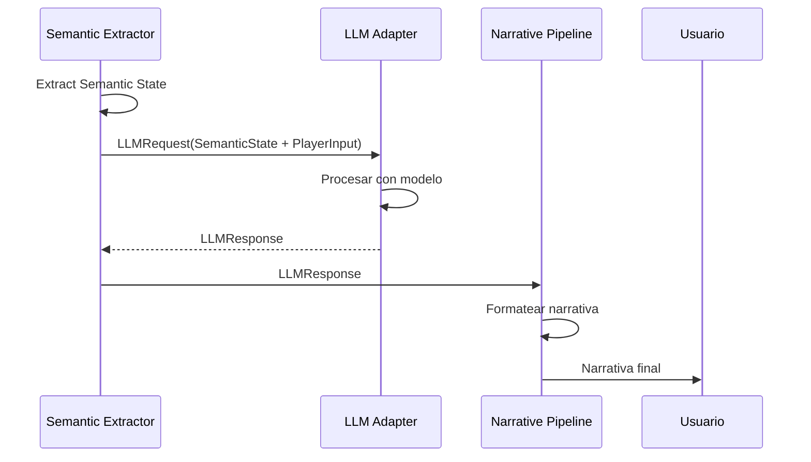

# Contrato del LLM

**Versión**: 0.1  
**Estado**: Sprint 0 — FROZEN  
**Última actualización**: 2026-07-26  
**ADR relacionado**: [ADR-0004](adr/0004-llm-as-function.md)

---

## 1. Principio Fundamental

> **El LLM es una función, no un controlador.**

El LLM nunca tiene acceso directo al mundo. Nunca muta Components. Nunca decide qué sucede. Recibe estado estructurado y produce estado estructurado.

```mermaid
graph LR
    subgraph "Entrada"
        SS[Semantic State]
    end

    subgraph "LLM"
        LLM[Modelo de Lenguaje]
    end

    subgraph "Salida"
        RESP[Respuesta Estructurada]
    end

    SS --> LLM
    LLM --> RESP
```

### 1.1 Lo que el LLM SÍ hace
- Interpreta el estado del mundo y lo traduce en narrativa.
- Genera diálogos coherentes con la personalidad del personaje.
- Produce pensamientos internos del personaje.
- Sugiere acciones basadas en el estado actual.

### 1.2 Lo que el LLM NO hace
- **No controla** qué sucede en el mundo.
- **No muta** Components directamente.
- **No decide** eventos del mundo.
- **No tiene** acceso al estado real del mundo (solo al Semantic State).
- **No puede** alterar el World State.

---

## 2. Abstracción del Proveedor

El motor no depende de ningún proveedor LLM específico. La abstracción permite cambiar entre proveedores sin modificar el simulador.

```csharp
public interface ILLMAdapter
{
    // Enviar Semantic State y recibir respuesta
    Task<LLMResponse> Generate(LLMRequest request);

    // Verificar si el adaptador está disponible
    bool IsAvailable();

    // Obtener información del modelo
    LLMModelInfo GetModelInfo();
}

public struct LLMRequest
{
    public string SystemPrompt;             // Instrucciones del sistema
    public string CharacterContext;         // Semantic State serializado
    public string PlayerInput;              // Acción del usuario
    public string ConversationHistory;     // Historial reciente
    public LLMConstraints Constraints;     // Restricciones de generación
}

public struct LLMResponse
{
    public string Narration;                // Narración descriptiva
    public string Dialogue;                 // Diálogo del personaje (si aplica)
    public string Thoughts;                 // Pensamientos internos
    public List<LLMAction> Actions;        // Acciones que el personaje realiza
    public LLMConfidence Confidence;        // Qué tan seguro está el LLM
    public string RawOutput;                // Salida cruda (para debugging)
}

public struct LLMAction
{
    public string Type;                     // "move", "speak", "inspect", "wait"
    public string Target;                   // Qué o quién
    public string Details;                  // Detalles adicionales
    public float Confidence;                // 0.0 a 1.0
}

public struct LLMConstraints
{
    public float Temperature;               // 0.0 (determinista) a 1.0 (creativo)
    public int MaxTokens;                   // Límite de tokens
    public List<string> ForbiddenTopics;    // Temas que no debe tocar
    public bool MustStayInCharacter;        // Forzar coherencia de personaje
    public bool CanBreakFourthWall;         // Si puede hablar como "personaje" vs "narrador"
}
```

---

## 3. Flujo de Datos



### 3.1 Detalle del Flujo

```csharp
public class LLMSystem
{
    private readonly ILLMAdapter _adapter;
    private readonly SemanticExtractor _semanticExtractor;
    private readonly NarrativePipeline _narrativePipeline;

    public async Task<string> ProcessTurn(World world, uint entityId, InputAction playerInput)
    {
        // 1. Construir Semantic State
        var semanticState = _semanticExtractor.Build(world, entityId);
        
        // 2. Serializar para el LLM
        var serializedState = SerializeSemanticState(semanticState);
        
        // 3. Construir prompt
        var request = new LLMRequest
        {
            SystemPrompt = BuildSystemPrompt(semanticState.Identity),
            CharacterContext = serializedState,
            PlayerInput = FormatPlayerInput(playerInput),
            ConversationHistory = GetRecentHistory(entityId),
            Constraints = GetConstraints(semanticState)
        };
        
        // 4. Llamar al LLM
        var response = await _adapter.Generate(request);
        
        // 5. Validar respuesta
        var validated = ValidateResponse(response, semanticState);
        
        // 6. Procesar a través del Narrative Pipeline
        var narrative = _narrativePipeline.Process(validated, semanticState);
        
        // 7. Guardar en historial
        SaveToHistory(entityId, playerInput, narrative);
        
        return narrative;
    }
}
```

---

## 4. Formato del Prompt

### 4.1 System Prompt

```
Eres {name}, un {species} de {ageYears} años.

PERSONALIDAD:
{personality}

ROL EN EL MUNDO:
{role}

REGLAS:
1. NUNCA reveles información que no esté en tu contexto.
2. NUNCA inventes eventos que no hayan ocurrido.
3. NUNCA rompas la cuarta pared.
4. Mantén tu personalidad coherente en cada respuesta.
5. Si no sabes algo, di que no sabes.
6. Si tienes una emoción, exprésala de forma coherente con tu personalidad.
7. Tus pensamientos internos deben reflejar tu estado emocional real.
8. respuestas concisas y naturales, como en una conversación real.
```

### 4.2 Contexto del Personaje (Semantic State serializado)

```json
{
  "situacion": {
    "ubicacion": "Ruta 15, borde del bosque",
    "hora": "atardecer (18:30)",
    "clima": "lluvia ligera",
    "compania": "Cedrick (entrenador, aliado potencial)"
  },
  "estado_interno": {
    "emocion": "curiosidad mezclada con cautela",
    "objetivo": "investigar las ruinas",
    "preocupacion": "que Cedrick revele sus planes",
    "estado_fisico": "moderadamente hambrienta, algo cansada"
  },
  "memoria_reciente": [
    "El anciano advirtió sobre las ruinas",
    "Cedrick ofreció guiarla"
  ],
  "conocimiento_relevante": [
    "Los Pokémon evitan la ruina"
  ]
}
```

### 4.3 Input del Jugador

```
ACCIÓN DEL JUGADOR:
Cedrick dice: "¿Quieres que vayamos juntos? Conozco bien esta zona."
```

### 4.4 Respuesta Esperada del LLM

```json
{
  "narration": "Aeris mira a Cedrick con cautela. La lluvia le cae suavemente en las alas mientras procesa su oferta.",
  "dialogue": "Conozco el camino... pero no necesito que me guíes. Puedo valerme por mí misma.",
  "thoughts": "No está segura de si puede confiar en él. La advertencia del anciano resonaba en su mente.",
  "actions": [
    {
      "type": "speak",
      "target": "Cedrick",
      "details": "Rechaza la oferta pero no de forma hostil",
      "confidence": 0.8
    }
  ],
  "confidence": "high"
}
```

---

## 5. Validación de Respuestas

El LLM puede producir errores. El motor **siempre** valida antes de aplicar.

```csharp
public class LLMResponseValidator
{
    public LLMResponse Validate(LLMResponse response, SemanticState state)
    {
        var validated = response;
        
        // Regla 1: No inventar ubicaciones
        if (ContainsUnverifiedLocation(response.Narration, state))
        {
            validated.Narration = RemoveUnverifiedContent(response.Narration);
        }
        
        // Regla 2: No revelar información secreta
        if (RevealsSecretInformation(response, state))
        {
            validated = FilterSecretInformation(validated, state);
        }
        
        // Regla 3: Mantener coherencia emocional
        if (!IsEmotionallyCoherent(response, state.Internal))
        {
            validated.Thoughts = AdjustThoughtsToEmotion(response.Thoughts, state.Internal);
        }
        
        // Regla 4: No romper la personalidad
        if (BreaksCharacter(response, state.Identity))
        {
            validated = RephraseInCharacter(response, state.Identity);
        }
        
        return validated;
    }
}
```

### 5.1 Reglas de Validación

| # | Regla | Acción si falla |
|---|---|---|
| 1 | No inventar ubicaciones no documentadas | Eliminar la mención |
| 2 | No revelar información que el personaje no debería saber | Filtrar la información |
| 3 | Mantener coherencia emocional | Ajustar pensamientos |
| 4 | No romper la personalidad | Reformular en voz del personaje |
| 5 | No generar acciones que el ECS no pueda ejecutar | Eliminar la acción |
| 6 | No exceder el límite de tokens | Truncar y marcar incompleto |

---

## 6. Manejo de Errores

```csharp
public class LLMErrorHandling
{
    public async Task<LLMResponse> SafeGenerate(LLMRequest request)
    {
        try
        {
            var response = await _adapter.Generate(request);
            
            if (response == null || string.IsNullOrEmpty(response.Narration))
            {
                return GenerateFallbackResponse(request);
            }
            
            return response;
        }
        catch (LLMTimeoutException)
        {
            // Timeout: usar respuesta de fallback
            return GenerateTimeoutResponse(request);
        }
        catch (LLMRateLimitException)
        {
            // Rate limit: esperar y reintentar
            await Task.Delay(1000);
            return await SafeGenerate(request);
        }
        catch (LLMUnavailableException)
        {
            // Servicio no disponible: usar respuesta local
            return GenerateLocalResponse(request);
        }
    }

    private LLMResponse GenerateFallbackResponse(LLMRequest request)
    {
        // Respuesta cuando el LLM falla
        return new LLMResponse
        {
            Narration = GenerateDescriptiveNarration(request.CharacterContext),
            Dialogue = "...",
            Thoughts = "Aeris no encuentra las palabras correctas.",
            Actions = new List<LLMAction>(),
            Confidence = LLMConfidence.Low,
            RawOutput = "FALLBACK_RESPONSE"
        };
    }
}
```

### 6.1 Estrategias de Fallback

| Error | Estrategia |
|---|---|
| Timeout | Narración descriptiva del entorno actual |
| Rate limit | Reintentar con backoff exponencial |
| Servicio no disponible | Respuesta local predefinida |
| Respuesta vacía | Narración genérica coherente |
| Respuesta inválida | Regenerar con prompt más estricto |

---

## 7. Gestión de Tokens

```csharp
public class TokenManager
{
    private const int MAX_CONTEXT_TOKENS = 8000;
    private const int MAX_RESPONSE_TOKENS = 1000;

    public LLMRequest OptimizeRequest(LLMRequest request)
    {
        var optimized = request;
        
        // Calcular tokens disponibles
        int systemTokens = CountTokens(request.SystemPrompt);
        int contextTokens = CountTokens(request.CharacterContext);
        int historyTokens = CountTokens(request.ConversationHistory);
        
        int availableForHistory = MAX_CONTEXT_TOKENS - systemTokens - contextTokens;
        
        if (historyTokens > availableForHistory)
        {
            // Truncar historial manteniendo lo más reciente
            optimized.ConversationHistory = TruncateToRecent(
                request.ConversationHistory, 
                availableForHistory
            );
        }
        
        // Si el contexto es demasiado grande, simplificar
        if (CountTokens(optimized.CharacterContext) > contextTokens * 0.6)
        {
            optimized.CharacterContext = SimplifyContext(optimized.CharacterContext);
        }
        
        return optimized;
    }
}
```

---

## 8. Adaptadores LLM (Implementaciones Futuras)

### 8.1 Interfaz

```csharp
// OpenAI / GPT
public class OpenAIAdapter : ILLMAdapter { ... }

// Anthropic / Claude
public class ClaudeAdapter : ILLMAdapter { ... }

// Ollama (local)
public class OllamaAdapter : ILLMAdapter { ... }

// llama.cpp (local)
public class LlamaCppAdapter : ILLMAdapter { ... }

// Respuesta local (sin LLM)
public class LocalAdapter : ILLMAdapter { ... }
```

### 8.2 Configuración

```json
{
  "llm": {
    "provider": "ollama",
    "model": "gemma2:9b",
    "endpoint": "http://localhost:11434",
    "apiKey": null,
    "temperature": 0.7,
    "maxTokens": 1000,
    "timeout": 30,
    "retries": 3
  }
}
```

---

## 9. Decisiones Abiertas

| Decisión | Estado | Quién resuelve | Cuándo |
|---|---|---|---|
| ¿Proveedor LLM por defecto? | Abierta | Sprint 3 | Al implementar LLMSystem |
| ¿Soporte para múltiples LLMs simultáneos? | Abierta | Sprint 4 | Cuando se tenga un segundo personaje LLM |
| ¿Cache de respuestas para debugging? | Abierta | Sprint 2 | Al tener primeros tests |
| ¿Streaming de respuestas? | Abierta | Sprint 3+ | Cuando se implemente UI interactiva |
