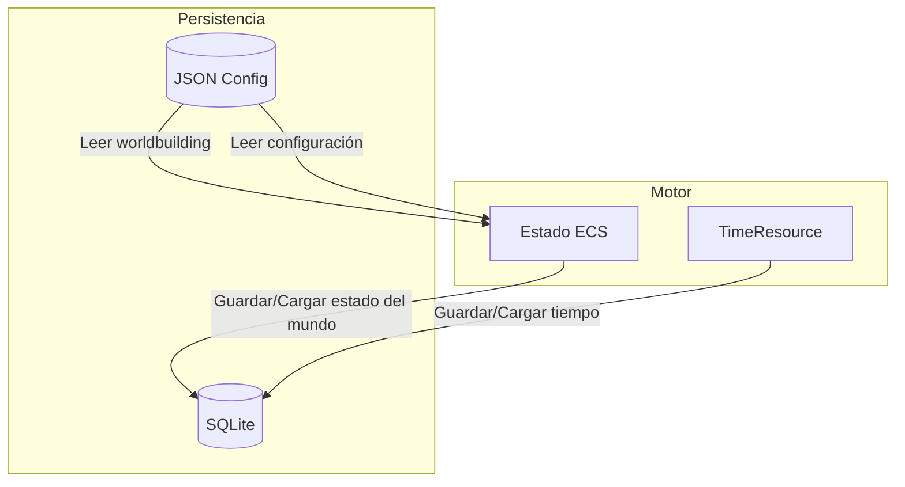

# Persistencia

**Versión**: 0.1  
**Estado**: Sprint 0 — Especificación  
**Última actualización**: 2026-07-26  
**ADR relacionado**: [ADR-0002](adr/0002-use-sqlite-json.md)

---

## 1. Estrategia Dual

El motor usa **dos sistemas de persistencia** para propósitos distintos:

| Sistema | Propósito | Razón |
|---|---|---|
| **SQLite** | Estado persistente del mundo | Consultas rápidas, transaccionalidad, integridad |
| **JSON** | Worldbuilding y configuración | Flexible, legible, fácil de editar manualmente |



---

## 2. SQLite — Estado del Mundo

### 2.1 Qué se guarda en SQLite

- Entitys y sus Components
- Resources globales (Time, WorldState)
- Historial de eventos
- Historial de relaciones
- Memorias de personajes
- Estado de ecosistemas
- Economía

### 2.2 Esquema de la Base de Datos

```sql
-- Tabla principal de Entitys
CREATE TABLE entities (
    id INTEGER PRIMARY KEY,
    type TEXT NOT NULL,           -- 'pokemon', 'human', 'location', etc.
    created_at REAL NOT NULL,
    destroyed_at REAL             -- null = activa
);

-- Tabla de Components (almacenamiento EAV)
CREATE TABLE components (
    entity_id INTEGER NOT NULL,
    component_type TEXT NOT NULL,
    data TEXT NOT NULL,            -- JSON serializado
    updated_at REAL NOT NULL,
    PRIMARY KEY (entity_id, component_type),
    FOREIGN KEY (entity_id) REFERENCES entities(id)
);

-- Tabla de Resources
CREATE TABLE resources (
    resource_type TEXT PRIMARY KEY,
    data TEXT NOT NULL,            -- JSON serializado
    updated_at REAL NOT NULL
);

-- Tabla de historial de eventos
CREATE TABLE event_history (
    id INTEGER PRIMARY KEY AUTOINCREMENT,
    event_type TEXT NOT NULL,
    data TEXT NOT NULL,            -- JSON serializado
    simulation_time REAL NOT NULL,
    created_at REAL NOT NULL
);

-- Tabla de historial de relaciones
CREATE TABLE relationship_history (
    id INTEGER PRIMARY KEY AUTOINCREMENT,
    entity_a INTEGER NOT NULL,
    entity_b INTEGER NOT NULL,
    relationship_type TEXT NOT NULL,
    value REAL NOT NULL,
    trust_level REAL NOT NULL,
    simulation_time REAL NOT NULL,
    description TEXT
);

-- Tabla de migraciones
CREATE TABLE schema_migrations (
    version INTEGER PRIMARY KEY,
    applied_at REAL NOT NULL,
    description TEXT
);
```

### 2.3 Acceso a SQLite

```csharp
public interface IWorldPersistence
{
    // Guardar estado completo
    void SaveWorld(World world);
    
    // Cargar estado completo
    World LoadWorld(string path);
    
    // Guardar una Entity específica
    void SaveEntity(Entity entity);
    
    // Cargar una Entity específica
    Entity? LoadEntity(uint entityId);
    
    // Guardar un Resource
    void SaveResource<T>(T resource) where T : struct;
    
    // Cargar un Resource
    T LoadResource<T>() where T : struct;
    
    // Guardar evento en historial
    void SaveEvent<T>(T evt, float simulationTime) where T : struct;
    
    // Consultar eventos por tipo
    List<T> QueryEvents<T>(float fromTime, float toTime) where T : struct;
    
    // Guardar relación
    void SaveRelationship(RelationshipData relationship);
    
    // Consultar historial de una relación
    List<RelationshipEvent> GetRelationshipHistory(uint entityA, uint entityB);
}
```

### 2.4 Estrategia de Guardado

```csharp
public class SaveStrategy : IPersistenceStrategy
{
    private float _lastSaveTime;
    private const float SAVE_INTERVAL = 300f; // Cada 5 minutos de simulación

    public bool ShouldSave(WorldState state)
    {
        // Guardar cada 5 minutos de simulación
        if (state.SimulationTime - _lastSaveTime >= SAVE_INTERVAL)
            return true;
        
        // Guardar al cambio de día
        if (state.DayChanged)
            return true;
        
        // Guardar después de eventos importantes
        if (state.HasSignificantEvent)
            return true;
        
        return false;
    }

    public void Save(WorldState state)
    {
        _persistence.SaveWorld(state.World);
        _lastSaveTime = state.SimulationTime;
    }
}
```

---

## 3. JSON — Worldbuilding y Configuración

### 3.1 Qué se guarda en JSON

- Definición de regiones y rutas
- Definición de especies Pokémon
- Definición de items
- Configuración del motor
- Configuración de LLM
- Configuración de dificultad
- Templates de prompts

### 3.2 Estructura de Archivos

```
data/
├── world/
│   ├── regions/
│   │   ├── route-15.json
│   │   ├── azalea-town.json
│   │   └── ...
│   ├── species/
│   │   ├── gardevoir.json
│   │   ├── charizard.json
│   │   └── ...
│   ├── items/
│   │   ├── potions.json
│   │   ├── pokéballs.json
│   │   └── ...
│   └── events/
│       ├── seasonal.json
│       ├── legendary-encounters.json
│       └── ...
├── config/
│   ├── engine.json
│   ├── llm.json
│   ├── difficulty.json
│   └── narrative.json
└── prompts/
    ├── system/
    │   ├── gardevoir.txt
    │   └── ...
    └── templates/
        ├── dialogue.txt
        └── narration.txt
```

### 3.3 Ejemplo: Definición de Región

```json
{
  "id": "route-15",
  "name": "Ruta 15",
  "type": "forest",
  "size": 500.0,
  "connectedRegions": ["azalea-town", "route-14", "ilex-forest"],
  "climate": {
    "baseTemperature": 18.0,
    "humidity": 0.7,
    "weatherPatterns": ["clear", "cloudy", "lightRain", "fog"]
  },
  "ecosystems": ["deciduous-forest", "stream"],
  "spawnPoints": [
    { "species": "oddish", "probability": 0.3, "level": [5, 10] },
    { "species": "bellsprout", "probability": 0.25, "level": [5, 10] },
    { "species": "pidgey", "probability": 0.4, "level": [3, 8] }
  ],
  "pointsOfInterest": [
    {
      "id": "old-ruins",
      "name": "Ruinas Antiguas",
      "type": "ruins",
      "description": "Estructura de piedra cubierta de enredaderas",
      "accessible": true,
      "dangerLevel": 0.6
    }
  ],
  "navigation": {
    "width": 500,
    "height": 300,
    "passableZones": [...],
    "blockedZones": [...]
  }
}
```

### 3.4 Ejemplo: Configuración del Motor

```json
{
  "engine": {
    "version": "0.1.0",
    "tickRate": 60,
    "timeScale": 1.0,
    "maxEntitiesActive": 100,
    "maxEntitiesPersistent": 10000,
    "saveInterval": 300,
    "autoSave": true
  },
  "simulation": {
    "seasonLengthDays": 91,
    "dayLengthSeconds": 86400,
    "weatherChangeProbability": 0.01,
    "ecosystemRegenerationRate": 0.001
  }
}
```

### 3.5 Ejemplo: Configuración del LLM

```json
{
  "llm": {
    "provider": "ollama",
    "model": "gemma2:9b",
    "endpoint": "http://localhost:11434",
    "temperature": 0.7,
    "maxTokens": 1000,
    "timeout": 30,
    "retries": 3,
    "fallbackToLocal": true
  },
  "narrative": {
    "maxMemoriesInContext": 10,
    "maxRelationshipsInContext": 5,
    "suspenseLevelDefault": 0.5,
    "pacingDefault": "moderate"
  }
}
```

---

## 4. Migraciones

### 4.1 Sistema de Versionado

```csharp
public class MigrationManager
{
    private const int CURRENT_VERSION = 1;

    public void Migrate(Database db)
    {
        int currentVersion = db.GetSchemaVersion();
        
        while (currentVersion < CURRENT_VERSION)
        {
            currentVersion++;
            ApplyMigration(db, currentVersion);
        }
    }

    private void ApplyMigration(Database db, int version)
    {
        var migration = GetMigration(version);
        
        using var transaction = db.BeginTransaction();
        try
        {
            migration.Up(db);
            db.SetSchemaVersion(version);
            transaction.Commit();
        }
        catch
        {
            transaction.Rollback();
            throw;
        }
    }
}
```

### 4.2 Ejemplo de Migración

```csharp
public class Migration002_AddAuraComponent : IMigration
{
    public int Version => 2;
    public string Description => "Add AuraComponent to all Pokemon entities";

    public void Up(Database db)
    {
        db.Execute(@"
            INSERT INTO components (entity_id, component_type, data, updated_at)
            SELECT id, 'aura', '{}', strftime('%s', 'now')
            FROM entities
            WHERE type = 'pokemon'
        ");
    }

    public void Down(Database db)
    {
        db.Execute(@"
            DELETE FROM components
            WHERE component_type = 'aura'
        ");
    }
}
```

---

## 5. Backup y Recuperación

```csharp
public class BackupManager
{
    private const int MAX_BACKUPS = 10;
    private const string BACKUP_DIR = "backups";

    public void CreateBackup(World world)
    {
        var timestamp = DateTime.Now.ToString("yyyyMMdd_HHmmss");
        var backupPath = Path.Combine(BACKUP_DIR, $"world_{timestamp}.db");
        
        // Copiar base de datos actual
        File.Copy(_dbPath, backupPath);
        
        // Mantener solo los últimos N backups
        CleanupOldBackups();
    }

    public World RestoreBackup(string backupPath)
    {
        // Verificar integridad del backup
        if (!VerifyBackup(backupPath))
            throw new CorruptedBackupException(backupPath);
        
        // Restaurar
        File.Copy(backupPath, _dbPath, overwrite: true);
        
        // Recargar mundo
        return _persistence.LoadWorld(_dbPath);
    }
}
```

---

## 6. Exportación

```csharp
public class WorldExporter
{
    // Exportar mundo completo a JSON (para debugging/sharing)
    public string ExportToJson(World world)
    {
        var export = new
        {
            version = "0.1.0",
            timestamp = DateTime.UtcNow,
            time = world.GetResource<TimeResource>(),
            entities = world.GetAllEntities().Select(e => new
            {
                id = e.Id,
                components = e.GetAllComponents()
            }),
            resources = world.GetAllResources()
        };
        
        return JsonSerializer.Serialize(export, new JsonSerializerOptions
        {
            WriteIndented = true
        });
    }
    
    // Exportar solo el estado narrativo (para debugging)
    public string ExportNarrativeState(World world, uint entityId)
    {
        var semanticState = _semanticExtractor.Build(world, entityId);
        return JsonSerializer.Serialize(semanticState, new JsonSerializerOptions
        {
            WriteIndented = true
        });
    }
}
```

---

## 7. Decisiones Abiertas

| Decisión | Estado | Quién resuelve | Cuándo |
|---|---|---|---|
| ¿Cómo se comprimen las backups? | Abierta | Sprint 2 | Cuando se implemente BackupManager |
| ¿SQLite en memoria o en disco para desarrollo? | Abierta | Sprint 1 | Al configurar la base de datos |
| ¿Cómo se sincronizan JSON files entre dispositivos? | Abierta | Sprint 4+ | Cuando se implemente multiplataforma |
| ¿Exportación a otros formatos (XML, YAML)? | Abierta | Sprint 4+ | Si se necesita compatibilidad |
