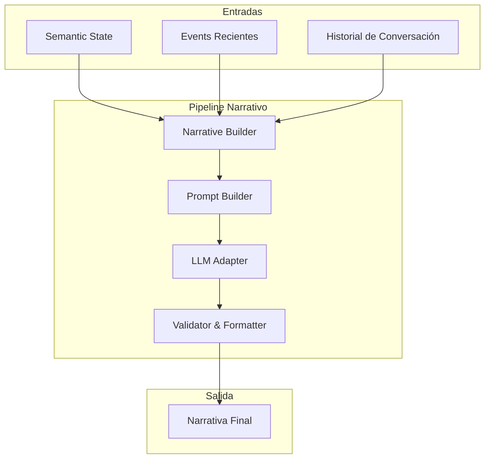
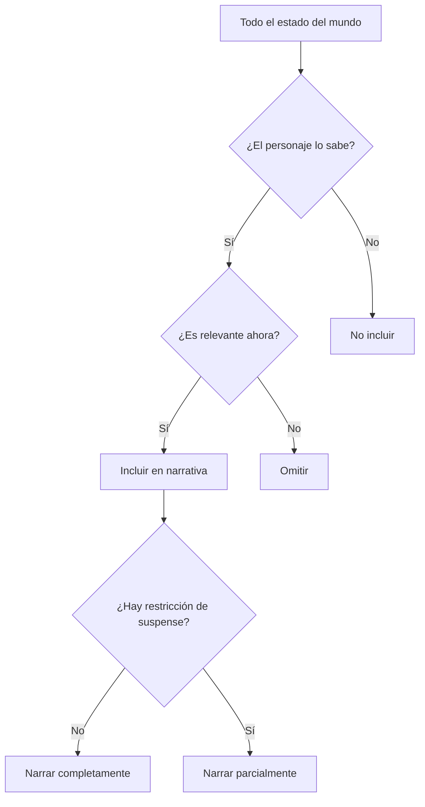

# Pipeline Narrativo

**Versión**: 0.1  
**Estado**: Sprint 0 — Especificación  
**Última actualización**: 2026-07-26

---

## 1. Definición

El **Pipeline Narrativo** transforma el estado del mundo en narrativa para el usuario. No inventa. No interpreta el mundo. Solo traduce un estado determinista a texto narrativo.



---

## 2. Fases del Pipeline

### 2.1 — Recopilación de Contexto

**Qué ocurre**: Se reúne toda la información necesaria para construir la narrativa.

```csharp
public class NarrativeContextBuilder
{
    public NarrativeContext Build(World world, uint entityId, LLMResponse llmResponse)
    {
        return new NarrativeContext
        {
            SemanticState = _semanticExtractor.Build(world, entityId),
            RecentEvents = GetRecentEvents(world, entityId, lastN: 5),
            ConversationHistory = GetConversationHistory(entityId, lastN: 10),
            WorldEvents = GetActiveWorldEvents(world),
            PlayerAction = GetCurrentPlayerAction(entityId)
        };
    }
}
```

### 2.2 — Selección de Elementos Narrativos

**Qué ocurre**: Se decide qué elementos incluir en la narración. No todo el estado se narra.

```csharp
public class NarrativeElementSelector
{
    public NarrativeElements Select(NarrativeContext context)
    {
        var elements = new NarrativeElements();
        
        // Elemento 1: Entorno (siempre presente)
        elements.Environment = SelectEnvironment(context);
        
        // Elemento 2: Acción (si el personaje hace algo)
        if (context.LLMResponse.Actions.Any())
            elements.Action = SelectAction(context);
        
        // Elemento 3: Diálogo (si el personaje habla)
        if (!string.IsNullOrEmpty(context.LLMResponse.Dialogue))
            elements.Dialogue = SelectDialogue(context);
        
        // Elemento 4: Pensamiento (si es relevante)
        if (ShouldIncludeThoughts(context))
            elements.Thoughts = SelectThoughts(context);
        
        // Elemento 5: Emoción (si es significativa)
        if (context.SemanticState.Internal.PrimaryEmotion != "neutral")
            elements.Emotion = SelectEmotion(context);
        
        return elements;
    }
}
```

### 2.3 — Construcción del Prompt

**Qué ocurre**: Se ensambla el prompt final para el LLM con todos los elementos seleccionados.

```csharp
public class PromptBuilder
{
    public string Build(NarrativeContext context, NarrativeElements elements)
    {
        var prompt = new StringBuilder();
        
        // Sección 1: Identidad del personaje
        prompt.AppendLine("PERSONAJE:");
        prompt.AppendLine(context.SemanticState.Identity.ToPromptString());
        prompt.AppendLine();
        
        // Sección 2: Situación actual
        prompt.AppendLine("SITUACIÓN:");
        prompt.AppendLine(context.SemanticState.Situation.ToPromptString());
        prompt.AppendLine();
        
        // Sección 3: Estado interno
        prompt.AppendLine("ESTADO INTERNO:");
        prompt.AppendLine(context.SemanticState.Internal.ToPromptString());
        prompt.AppendLine();
        
        // Sección 4: Elementos narrativos a incluir
        prompt.AppendLine("ELEMENTOS A NARRAR:");
        prompt.AppendLine(elements.ToPromptString());
        prompt.AppendLine();
        
        // Sección 5: Instrucciones del narrador
        prompt.AppendLine("INSTRUCCIONES:");
        prompt.AppendLine(BuildInstructions(context.SemanticState.Directives));
        prompt.AppendLine();
        
        // Sección 6: Formato esperado
        prompt.AppendLine("FORMATO:");
        prompt.AppendLine("Genera una narración que incluya:");
        prompt.AppendLine("- Descripción del entorno (si es relevante)");
        prompt.AppendLine("- Acción del personaje (si aplica)");
        prompt.AppendLine("- Diálogo (si el personaje habla)");
        prompt.AppendLine("- Pensamientos internos (si son relevantes)");
        prompt.AppendLine();
        prompt.AppendLine("Respuesta en JSON con la estructura definida.");
        
        return prompt.ToString();
    }
}
```

### 2.4 — Generación con el LLM

**Qué ocurre**: Se envía el prompt al LLM y se recibe la respuesta.

```csharp
public class NarrativeGenerator
{
    public async Task<LLMResponse> Generate(NarrativeContext context)
    {
        var elements = _elementSelector.Select(context);
        var prompt = _promptBuilder.Build(context, elements);
        
        var request = new LLMRequest
        {
            SystemPrompt = _systemPrompt,
            CharacterContext = prompt,
            PlayerInput = FormatPlayerInput(context.PlayerAction),
            ConversationHistory = FormatHistory(context.ConversationHistory),
            Constraints = new LLMConstraints
            {
                Temperature = 0.7f,
                MaxTokens = 1000,
                MustStayInCharacter = true,
                CanBreakFourthWall = false
            }
        };
        
        return await _llmAdapter.Generate(request);
    }
}
```

### 2.5 — Validación y Formateo

**Qué ocurre**: Se valida la respuesta del LLM y se formatea para el usuario.

```csharp
public class NarrativeValidator
{
    public NarrationResult Validate(LLMResponse response, NarrativeContext context)
    {
        var result = new NarrationResult();
        
        // Validar narración
        if (!string.IsNullOrEmpty(response.Narration))
        {
            result.Narration = ValidateNarration(response.Narration, context);
        }
        
        // Validar diálogo
        if (!string.IsNullOrEmpty(response.Dialogue))
        {
            result.Dialogue = ValidateDialogue(response.Dialogue, context);
        }
        
        // Validar pensamientos
        if (!string.IsNullOrEmpty(response.Thoughts))
        {
            result.Thoughts = ValidateThoughts(response.Thoughts, context);
        }
        
        // Validar acciones
        result.Actions = ValidateActions(response.Actions, context);
        
        // Formatear salida final
        result.FormattedOutput = FormatOutput(result);
        
        return result;
    }
}
```

---

## 3. Restricciones del Narrador

### 3.1 Reglas Fundamentales

| # | Regla | Ejemplo de violación |
|---|---|---|
| 1 | No revelar información que el personaje no debería saber | "Aeris sabía que el villano estaba en la cueva" (si no lo ha visto) |
| 2 | No inventar eventos que no hayan ocurrido | "Aeris derrotó al Team Rocket" (si no ha luchado) |
| 3 | No resolver misterios pendientes | "La ruina contenía un arma ancestral" (si es un misterio activo) |
| 4 | No romper la personalidad del personaje | "Aeris empezó a cantar alegría" (si es cautelosa) |
| 5 | No narrar mecánicas del juego | "Aeris ganó 500 puntos de experiencia" |
| 6 | No predecir el futuro | "Mañana Aeris encontrará algo importante" |
| 7 | No describir lo que otros piensan realmente | "Cedrick estaba planeando traicionarla" (si Aeris no lo sabe) |

### 3.2 Niveles de Suspense

```csharp
public enum SuspenseLevel
{
    None = 0,         // Narrar todo lo que se sabe
    Low = 1,          // Omitir detalles menores
    Medium = 2,       // Mantener algo de misterio
    High = 3,         // Máximo misterio, revelar poco
    Extreme = 4       // Solo lo esencial, todo es incierto
}
```

### 3.3 Gestión de la Información



---

## 4. Formato de Salida

### 4.1 Estructura de la Narración

```csharp
public struct NarrationResult
{
    public string Narration;        // Texto narrativo principal
    public string Dialogue;         // Diálogo del personaje
    public string Thoughts;         // Pensamientos internos
    public List<LLMAction> Actions; // Acciones realizadas
    public string FormattedOutput;  // Salida formateada para el usuario
    public NarrationMetadata Metadata; // Metadatos para debugging
}

public struct NarrationMetadata
{
    public float GenerationTime;    // Tiempo que tomó generar
    public int TokensUsed;          // Tokens consumidos
    public LLMConfidence Confidence; // Confianza del LLM
    public List<string> Warnings;   // Advertencias de validación
    public string RawLLMOutput;     // Salida cruda (debugging)
}
```

### 4.2 Ejemplo de Salida Formateada

```
=== AERIS ===

La lluvia cae suavemente sobre las hojas del bosque mientras el
atardecer pinta el cielo de naranja y gris. Aeris camina lentamente
por el sendero mojado, con Cedrick a unos pasos de distancia.

"Hmm..." — Aeris murmura para sí misma, procesando la oferta
de Cedrick. — "Puedo valerme por mí misma. No necesito un guía."

Pero en su interior, una parte de ella sabe que no está del todo
segura. La advertencia del anciano resonaba en su mente como un
eco persistente.

[Acción: Camina hacia la entrada de la ruina]
[Emociones: Curiosidad (0.6), Cautela (0.5)]
```

---

## 5. Narración en Modo Simulación (sin usuario)

Cuando el usuario no interactúa, el motor genera narrativa de fondo:

```csharp
public class BackgroundNarrator
{
    public async Task<string> GenerateBackground(World world)
    {
        // Seleccionar personajes activos
        var activeCharacters = world.GetActiveCharacters();
        
        var narratives = new List<string>();
        
        foreach (var character in activeCharacters)
        {
            // Construir Semantic State para el personaje
            var semanticState = _semanticExtractor.Build(world, character.Id);
            
            // Generar narrativa de fondo
            var narrative = await _llmAdapter.Generate(new LLMRequest
            {
                SystemPrompt = BuildBackgroundPrompt(semanticState),
                CharacterContext = SerializeState(semanticState),
                Constraints = new LLMConstraints
                {
                    Temperature = 0.8f, // Más creativo para narrativa de fondo
                    MaxTokens = 200,
                    MustStayInCharacter = true
                }
            });
            
            narratives.Add(narrative.Narration);
        }
        
        return string.Join("\n\n", narratives);
    }
}
```

---

## 6. Decisiones Abiertas

| Decisión | Estado | Quién resuelve | Cuándo |
|---|---|---|---|
| ¿La narración se genera en tiempo real o se cachea? | Abierta | Sprint 3 | Cuando se tenga UI funcional |
| ¿Cómo se manejan múltiples personajes narrando simultáneamente? | Abierta | Sprint 4 | Cuando se tenga más de un personaje activo |
| ¿Streaming de narración? | Abierta | Sprint 3+ | Cuando se implemente UI interactiva |
| ¿Narración en múltiples idiomas? | Abierta | Sprint 4+ | Cuando se implemente sistema de idiomas |
