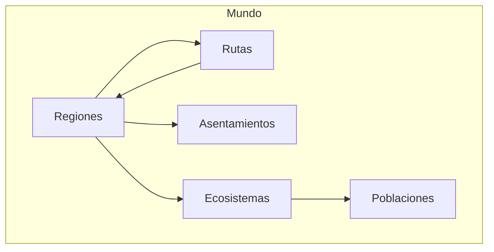
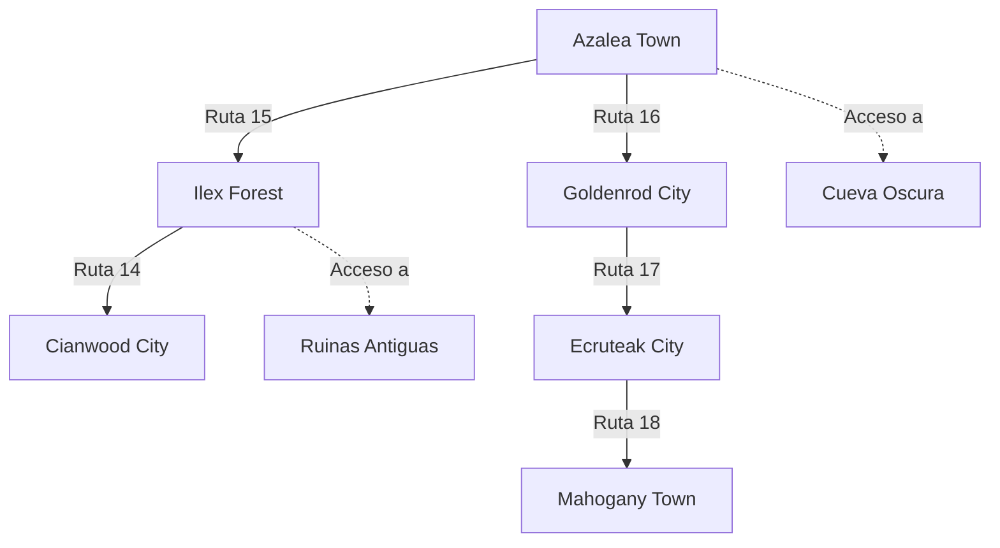

# Modelo del Mundo

**Versión**: 0.1  
**Estado**: Sprint 0 — Especificación  
**Última actualización**: 2026-07-26

---

## 1. Definición

El **Modelo del Mundo** define la estructura abstracta del mundo en el que existe Aeris. No es el worldbuilding detallado (biología Pokémon, idiomas, historia). Es la **arquitectura espacial y relacional** que el motor necesita para funcionar.



---

## 2. Entidades del Mundo

### 2.1 Región

Una **Región** es la unidad espacial principal del mundo. Contiene rutas, asentamientos y ecosistemas.

```csharp
public struct RegionDefinition
{
    public uint RegionId;
    public string Name;
    public string Description;
    public RegionType Type;
    public float Size;                      // Tamaño en unidades del mundo
    
    // Conexiones
    public List<uint> ConnectedRegions;     // Regiones colindantes
    public List<uint> Routes;               // Rutas que la atraviesan
    public List<uint> Settlements;          // Asentamientos dentro
    
    // Ecosistemas
    public List<uint> Ecosystems;           // Ecosistemas presentes
    
    // Estado
    public ClimateData Climate;
    public float DangerLevel;               // 0.0 (seguro) a 1.0 (extremadamente peligroso)
    public float ResourceAbundance;         // 0.0 (escaso) a 1.0 (abundante)
    
    // Acceso
    public bool IsDiscovered;               // ¿El jugador la ha descubierto?
    public AccessCondition AccessCondition; // Cómo se accede
}

public enum RegionType
{
    Forest,
    Mountain,
    Plains,
    Desert,
    Swamp,
    Coast,
    Urban,
    Ruins,
    Cave,
    Volcano,
    Tundra,
    Ocean,
    Sky,
    Underground
}

public enum AccessCondition
{
    Open,               // Acceso libre
    KeyRequired,        // Necesita objeto específico
    QuestRequired,      // Necesita completar misión
    LevelRequired,      // Necesita nivel mínimo
    StoryRequired       // Necesita avanzar en la historia
}
```

### 2.2 Ruta

Una **Ruta** es un camino que conecta dos o más regiones.

```csharp
public struct RouteDefinition
{
    public uint RouteId;
    public string Name;
    public string Description;
    public RouteType Type;
    
    // Conexiones
    public uint OriginRegionId;
    public uint DestinationRegionId;
    public List<uint> Waypoints;            // Puntos intermedios
    
    // Propiedades
    public float Length;                     // Distancia en unidades
    public float Difficulty;                 // 0.0 (fácil) a 1.0 (extremo)
    public RouteTerrain Terrain;
    
    // Contenido
    public List<SpawnPoint> WildSpawns;     // Pokémon que aparecen
    public List<uint> PointsOfInterest;     // Lugares de interés
    public List<RouteEvent> PossibleEvents; // Eventos que pueden ocurrir
    
    // Estado
    public bool IsPassable;                 // ¿Se puede usar ahora?
    public string BlockReason;              // Por qué está bloqueada (si aplica)
}

public enum RouteType
{
    MainRoad,           // Camino principal
    ForestPath,         // Sendero de bosque
    MountainPass,       // Paso de montaña
    Waterway,           // Vía fluvial
    UndergroundTunnel,  // Túnel subterráneo
    SkyRoute,           // Ruta aérea
    HiddenPath          // Camino oculto
}

public enum RouteTerrain
{
    Paved,
    Dirt,
    Gravel,
    Grass,
    Sand,
    Snow,
    Ice,
    Water,
    Rocky,
    Swampy
}
```

### 2.3 Asentamiento

Un **Asentamiento** es un lugar donde habitan personajes de forma permanente.

```csharp
public struct SettlementDefinition
{
    public uint SettlementId;
    public string Name;
    public string Description;
    public SettlementType Type;
    public uint RegionId;
    
    // Población
    public int Population;
    public List<uint> ResidentEntities;     // Entitys que viven aquí
    public List<uint> VisitingEntities;     // Entitys temporalmente aquí
    
    // Servicios
    public List<SettlementService> Services;
    
    // Economía
    public float Prosperity;                // 0.0 (pobre) a 1.0 (próspero)
    public List<TradeGood> AvailableGoods;
    
    // Cultura
    public string Culture;
    public List<string> Traditions;
    public string GoverningBody;
    
    // Conexiones
    public List<uint> ConnectedRoutes;
}

public enum SettlementType
{
    City,               // Ciudad grande
    Town,               // Pueblo
    Village,            // Aldea
    Hamlet,             // Caserío
    Outpost,            // Puesto avanzado
    Camp,               // Campamento temporal
    Ruins,              // Asentamiento abandonado
    HiddenSettlement    // Asentamiento secreto
}

public struct SettlementService
{
    public ServiceType Type;
    public bool IsAvailable;
    public string Description;
}

public enum ServiceType
{
    PokemonCenter,      // Curar Pokémon
    PokeMart,           // Tienda
    Gym,                // Gimnasio
    Library,            // Biblioteca
    Observatory,        // Observatorio
    Temple,             // Templo
    Guild,              // Gremio
    Market,             // Mercado
    Stable,             // Establo
    Dock                // Muelle
}
```

### 2.4 Ecosistema

Un **Ecosistema** es una comunidad de seres vivos y su entorno.

```csharp
public struct EcosystemDefinition
{
    public uint EcosystemId;
    public string Name;
    public string Description;
    public EcosystemType Type;
    public uint RegionId;
    
    // Población
    public List<SpeciesPopulation> Species;
    public float Biodiversity;              // 0.0 (muerto) a 1.0 (exuberante)
    public float Health;                    // 0.0 (colapsado) a 1.0 (próspero)
    
    // Recursos
    public List<ResourceNode> Resources;    // Recursos disponibles
    public float ResourceRegenerationRate;
    
    // Condiciones
    public float TemperatureRange;          // Variación tolerable
    public float WaterAvailability;
    public float ShelterAvailability;
    
    // Eventos
    public List<EcosystemEvent> ActiveEvents;
    public List<EcosystemEvent> History;
}

public enum EcosystemType
{
    DeciduousForest,    // Bosque caducifolio
    ConiferousForest,   // Bosque de coníferas
    TropicalRainforest, // Selva tropical
    Grassland,          // Pradera
    Wetland,            // Humedal
    Desert,             // Desierto
    Tundra,             // Tundra
    CoralReef,          // Arrecife de coral
    DeepOcean,          // Océano profundo
    Cave,               // Cueva
    Urban,              // Urbano (parques, jardines)
    Volcanic            // Volcánico
}
```

### 2.5 Población

Una **Población** es un grupo de la misma especie que habita un ecosistema.

```csharp
public struct SpeciesPopulation
{
    public uint SpeciesId;
    public string SpeciesName;
    public int Count;
    public float Density;                   // Individuos por unidad de área
    public PopulationStatus Status;
    public List<PopulationTrend> Trends;
    
    // Distribución
    public float PreferredHabitat;          // 0.0 (cualquier lugar) a 1.0 (muy específico)
    public List<BiomePreference> BiomePreferences;
    
    // Comportamiento
    public MigrationPattern Migration;
    public SocialStructure Social;
    public DietType Diet;
}

public enum PopulationStatus
{
    Thriving,           // Creciendo
    Stable,             // Equilibrado
    Declining,          // Disminuyendo
    Endangered,         // En peligro
    Extinct,            // Extinto en la zona
    Migrating           // En migración
}

public struct MigrationPattern
{
    public MigrationType Type;
    public List<uint> MigrationRoutes;      // Rutas que usa
    public float Frequency;                 // Cada cuánto migra
    public float LastMigrationTime;
}

public enum MigrationType
{
    Seasonal,           // Estacional
    Daily,              // Diaria
    Breeding,           // Reproductiva
    FoodBased,          // Búsqueda de alimento
    EventDriven         // Causada por eventos
}
```

---

## 3. Relaciones Espaciales

### 3.1 Grafo del Mundo

El mundo se modela como un **grafo** donde las Regiones son nodos y las Rutas son aristas.



### 3.2 Navegación

```csharp
public interface IWorldNavigation
{
    // Obtener regiones conectadas
    List<uint> GetConnectedRegions(uint regionId);
    
    // Obtener ruta entre dos regiones
    RouteDefinition? GetRouteBetween(uint from, uint to);
    
    // Verificar si se puede viajar
    bool CanTravel(uint from, uint to, Entity traveler);
    
    // Calcular distancia
    float GetDistance(uint from, uint to);
    
    // Encontrar camino más corto
    List<uint> FindPath(uint from, uint to);
    
    // Obtener entities en una región
    List<uint> GetEntitiesInRegion(uint regionId);
    
    // Obtener entities en un radio
    List<uint> GetEntitiesNearby(uint regionId, float x, float y, float radius);
}
```

---

## 4. Entidades del Mundo como Entitys ECS

Las entidades del mundo (Regiones, Rutas, Asentamientos) son **Entitys ECS** con Components específicos:

| Entidad ECS | Components |
|---|---|
| Región | `RegionComponent`, `LocationComponent`, `ClimateComponent` |
| Ruta | `RouteComponent`, `OriginComponent`, `DestinationComponent` |
| Asentamiento | `SettlementComponent`, `LocationComponent`, `PopulationComponent` |
| Ecosistema | `EcosystemComponent`, `LocationComponent`, `HealthComponent` |
| Pokémon salvaje | `IdentityComponent`, `LocationComponent`, `WildBehaviorComponent` |
| NPC | `IdentityComponent`, `LocationComponent`, `AIComponent`, `ScheduleComponent` |

---

## 5. Eventos del Mundo

### 5.1 Tipos de Eventos

```csharp
public enum WorldEventType
{
    // Naturales
    WeatherChange,
    SeasonChange,
    NaturalDisaster,
    EcologicalEvent,
    
    // Sociales
    Festival,
    Protest,
    War,
    TradeRoute,
    
    // Ecológicos
    Migration,
    PopulationBoom,
    PopulationCrash,
    Extinction,
    Discovery,
    
    // Jugador
    PlayerArrival,
    PlayerDiscovery,
    PlayerAction
}
```

### 5.2 Generación de Eventos

```csharp
public class WorldEventGenerator
{
    public List<WorldEvent> GenerateEvents(World world, float deltaTime)
    {
        var events = new List<WorldEvent>();
        
        // Eventos de clima
        events.AddRange(GenerateWeatherEvents(world, deltaTime));
        
        // Eventos estacionales
        events.AddRange(GenerateSeasonalEvents(world, deltaTime));
        
        // Eventos ecológicos
        events.AddRange(GenerateEcologicalEvents(world, deltaTime));
        
        // Eventos sociales
        events.AddRange(GenerateSocialEvents(world, deltaTime));
        
        return events;
    }
}
```

---

## 6. Decisiones Abiertas

| Decisión | Estado | Quién resuelve | Cuándo |
|---|---|---|---|
| ¿El mundo es procedural o estáticamente definido? | Abierta | Sprint 3 | Cuando se implemente worldbuilding |
| ¿Cómo se manejan las regiones no descubiertas? | Abierta | Sprint 2 | Al implementar navegación |
| ¿Las regiones se cargan todas o bajo demanda? | Abierta | Sprint 2 | Al implementar gestión de memoria |
| ¿Cómo se representan los límites entre regiones? | Abierta | Sprint 2 | Al implementar navegación |
