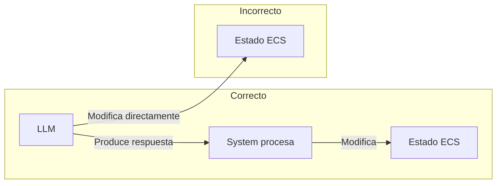
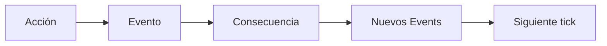

# Invariantes del Motor

**Versión**: 0.1  
**Estado**: Sprint 0 — FROZEN  
**Última actualización**: 2026-07-26

---

## 1. Definición

Un **invariante** es una regla que **nunca** puede romperse en ninguna circunstancia. Si un invariante se viola, el motor está en un estado inválido y debe detenerse o recuperarse.

Estos invariantes son la **constitución** del motor. Cualquier cambio futuro debe respetarlos.

---

## 2. Invariantes Fundamentales

### INV-001: Separación de Responsabilidades

> **Ningún System modifica Components que no estén en su contrato de escritura.**

Un System solo puede modificar los Components que ha declarado explícitamente en `WriteComponents`. Si un System necesita modificar un Component que no está en su contrato, debe hacerlo a través de un Evento que otro System procese.

**Razón**: Previene efectos secundarios inesperados y hace que el sistema sea predecible.

```csharp
// VIOLACIÓN de INV-001
public class BadSystem : ISystem
{
    public Archetype ReadFilter => new(typeof(HealthComponent));
    public Type[] WriteComponents => new[] { typeof(HealthComponent) };
    
    public void Execute(World world, float deltaTime)
    {
        foreach (var entity in world.Query(ReadFilter))
        {
            // BIEN: Modifica HealthComponent (está en WriteComponents)
            ref var health = ref entity.Get<HealthComponent>();
            health.Current -= 1;
            
            // VIOLACIÓN: Modifica RelationshipComponent (NO está en WriteComponents)
            ref var rel = ref entity.Get<RelationshipComponent>(); // ← PROHIBIDO
            rel.Value -= 0.1f;
        }
    }
}
```

---

### INV-002: El LLM nunca controla el mundo

> **El LLM nunca altera directamente el World State.**

El LLM produce resultados estructurados que los Systems procesan. El LLM no puede crear Entitys, modificar Components, emitir Events, ni cambiar Resources.

**Razón**: Mantiene la separación entre simulación determinista y generación probabilística.



---

### INV-003: Toda modificación persistente pasa por Systems

> **Ninguna Entity, Component o Resource se modifica fuera de un System.**

Excepto por:
- Creación de Entitys (World.CreateEntity)
- Asignación inicial de Components (World.AddComponent)
- Carga desde persistencia (LoadWorld)

Toda modificación durante la ejecución del motor debe ser realizada por un System.

**Razón**: Garantiza que todas las mutaciones son auditable y predecibles.

---

### INV-004: Toda acción genera consecuencias observables

> **Ninguna acción ocurre sin una reacción en cadena.**

Si un System produce un Evento, ese Evento debe ser procesado por al menos un System. Si una acción no tiene consecuencias observables, no debería existir como Evento.

**Razón**: Mantiene la coherencia causal del mundo. Nada ocurre porque sí.



---

### INV-005: El usuario nunca modifica el mundo directamente

> **El usuario solo expresa acciones o intenciones de su personaje.**

El usuario no puede:
- Crear o destruir Entitys directamente.
- Modificar Components de otros personajes.
- Cambiar el estado del mundo.
- Alterar el tiempo de simulación.

El usuario puede:
- Expresar una acción (mover, hablar, inspeccionar).
- Expresar una intención (quiero ir allí, quiero hablar con...).
- Esperar (pasar tiempo).

**Razón**: El usuario es parte del mundo, no su centro. Su influencia es a través de su personaje.

---

### INV-006: El tiempo de simulación nunca retrocede

> **`TimeResource.SimulationTime` solo puede aumentar.**

No hay "deshacer" temporal. No hay viajes en el tiempo. No hay rewinds. Si algo ocurre, ya ocurrió.

**Razón**: Simplifica enormemente la lógica del motor y previene paradojas causales.

---

### INV-007: Todo Component es serializable

> **Todo Component debe poder serializarse y deserializarse completamente.**

Un Component que no sea serializable no puede:
- Guardarse en persistencia.
- Debuggearse.
- Exportarse.
- Enviarse a un LLM (a través del Semantic State).

**Razón**: La persistencia y el debugging son fundamentales.

---

### INV-008: Los Events son inmutables después de emitidos

> **Un Event, una vez emitido, no puede ser modificado.**

Los Events son datos de solo lectura. Si un System necesita "responder" a un Event con nuevos datos, emite un nuevo Event.

**Razón**: Previene condiciones de carrera y efectos secundarios inesperados.

---

### INV-009: Un System no tiene estado propio

> **Un System no almacena datos entre ticks (excepto configuración inmutable).**

Un System es una función pura: recibe World + deltaTime, ejecuta su lógica, y termina. No guarda estado entre ticks.

Excepción: Configuración inmutable definida al inicio (como `ExecutionOrder` o `ReadFilter`).

**Razón**: Hace que los Systems sean testables y predecibles.

---

### INV-010: El Semantic State es un subconjunto, no una copia

> **El Semantic State nunca contiene todo el estado del mundo.**

El Semantic State es un **subconjunto filtrado y traducido** del estado del mundo. Contiene solo lo que el LLM necesita para generar narrativa coherente, no todo lo que el mundo contiene.

**Razón**: Eficiencia (tokens), privacidad del personaje (no debería saber todo), y mantenimiento de misterio.

---

### INV-011: Todo el motor consulta el tiempo de simulación

> **Ningún System conoce el tiempo real excepto el TimeSystem.**

Todos los cálculos temporales usan `TimeResource.SimulationTime` o `TimeResource.SimulationDeltaTime`. El tiempo real solo se usa para calcular la escala de tiempo.

**Razón**: Permite acelerar, pausar y ejecutar el motor headless sin perder coherencia.

---

### INV-012: La UI es intercambiable

> **El motor puede funcionar sin interfaz gráfica.**

El motor no depende de ningún framework de UI. Puede ejecutarse como:
- CLI (terminal)
- GUI (Avalonia, MAUI, Godot)
- Web (API)
- Headless (pruebas automatizadas)

**Razón**: Flexibilidad de implementación y testing.

---

## 3. Invariantes de Integridad

### INV-020: Toda Entity tiene exactamente un IdentityComponent

> **No puede existir una Entity sin identidad.**

Una Entity sin `IdentityComponent` es una Entity huérfana y debe ser destruida.

### INV-021: Los IDs son únicos y no reutilizados

> **Un Entity ID nunca se reutiliza.**

Si una Entity es destruida, su ID queda reservado permanentemente. Esto previene referencias colgantes.

### INV-022: Las referencias entre modelos usan IDs, no objetos

> **Los modelos de datos referencian otros elementos por ID, no por referencia directa.**

Un `MemoryData.InvolvedEntities` contiene una `List<uint>`, no una `List<Entity>`. Esto garantiza serialización segura y previene referencias circulares.

---

## 4. Invariantes de Consistencia

### INV-030: Un personaje no puede conocer lo que no ha percibido

> **El Semantic State de un personaje solo incluye información que el personaje podría conocer.**

Si un evento ocurre en otra región y el personaje no tiene forma de saberlo, no puede aparecer en su Semantic State.

### INV-031: Las creencias pueden estar equivocadas

> **Un personaje puede creer algo falso.**

El sistema de `BeliefData` permite que un personaje tenga creencias incorrectas. El motor no corrige automáticamente las creencias falsas; se revisan solo con nueva evidencia.

### INV-032: Las memorias se degradan con el tiempo

> **Las memorias antiguas pierden importancia y certeza.**

El `MemoryDecaySystem` debe ejecutarse periódicamente para degradar memorias. Las memorias no son permanentes.

### INV-033: Las relaciones cambian con las interacciones

> **Las relaciones no son estáticas. Se actualizan basado en interacciones y eventos.**

Un `RelationshipData.Value` puede cambiar en cualquier tick basado en eventos recientes.

---

## 5. Invariantes de Seguridad

### INV-040: El LLM nunca recibe claves ni secretos

> **El Semantic State y los prompts nunca contienen información sensible del sistema.**

No se incluyen en prompts:
- API keys
- Contraseñas
- Información de depuración del motor
- Estado interno del ECS (solo el Semantic State)

### INV-041: La persistencia se guarda en transacciones

> **Las operaciones de guardado se ejecutan dentro de transacciones SQLite.**

Si un guardado falla, la base de datos queda en el estado anterior. No hay guardados parciales.

---

## 6. Verificación de Invariantes

### 6.1 Tests de Invariantes

Cada invariante debe tener al menos un test que verifique que se cumple:

```csharp
[Test]
public void INV001_SystemOnlyModifiesDeclaredComponents()
{
    var world = new World();
    var system = new HealthSystem();
    
    // Registrar state anterior
    var beforeState = world.Get EntityState();
    
    // Ejecutar system
    system.Execute(world, 1.0f);
    
    // Verificar que solo se modificaron Components declarados
    var afterState = world.Get EntityState();
    
    foreach (var entity in world.GetAllEntities())
    {
        // HealthComponent puede haber cambiado
        // RelationshipComponent NO debería haber cambiado
        Assert.AreEqual(
            beforeState.GetRelationship(entity),
            afterState.GetRelationship(entity),
            $"INV-001 violado: RelationshipComponent modificado por HealthSystem"
        );
    }
}
```

### 6.2 Assertions en Producción

Para invariantes críticos, usar assertions que detengan el motor en desarrollo:

```csharp
public class InvariantChecker
{
    public void CheckAll(World world)
    {
        CheckINV001(world);
        CheckINV003(world);
        CheckINV007(world);
        CheckINV020(world);
        CheckINV021(world);
    }
    
    private void CheckINV001(World world)
    {
        // Verificar que ningún System modificó Components no declarados
        // (Implementación específica del sistema de tracking)
    }
}
```

---

## 7. Cambios a Invariantes

Los invariantes son **casi inmutables**. Para cambiar uno:

1. Crear un ADR que documente por qué el invariante actual ya no es válido.
2. Documentar las consecuencias del cambio.
3. Implementar una migración si el cambio afecta datos existentes.
4. Obtener aprobación del mantenedor del proyecto.

**Nunca** se rompe un invariante "porque es más fácil". Si algo parece necesitar romper un invariante, probablemente la arquitectura necesita una revisión.
