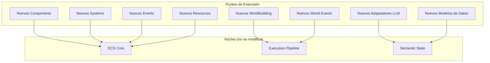

# Puntos de Extensión

**Versión**: 0.1  
**Estado**: Sprint 0 — FROZEN  
**Última actualización**: 2026-07-26

---

## 1. Definición

Un **punto de extensión** es un lugar del motor diseñado para ser extendido sin modificar el núcleo. El motor se construye para ser extendido, no modificado.



---

## 2. Nuevos Components

### 2.1 Cómo añadir un Component

```csharp
// 1. Definir el modelo de datos (en 03-data-models.md)
public struct NewFeatureData
{
    public float Value;
    public string Description;
    public List<string> Tags;
}

// 2. Definir el Component (en el proyecto)
public struct NewFeatureComponent
{
    public NewFeatureData Data;
}

// 3. Registrar el Component en el World
world.RegisterComponent<NewFeatureComponent>();

// 4. Asignar a Entitys que lo necesiten
world.AddComponent(entity, new NewFeatureComponent
{
    Data = new NewFeatureData { Value = 1.0f }
});
```

### 2.2 Ejemplos de Extensions de Components

| Component | Sprint | Descripción |
|---|---|---|
| `CombatStatsComponent` | Fase 2 | Estadísticas de combate |
| `EvolutionComponent` | Fase 2 | Datos de evolución |
| `MoveSetComponent` | Fase 2 | Movimientos conocidos |
| `WeatherResistanceComponent` | Fase 2 | Resistencia al clima |
| `LanguageFluencyComponent` | Fase 3 | Dominio de idiomas |
| `FactionMembershipComponent` | Fase 3 | Pertenencia a facciones |
| `EconomicStatusComponent` | Fase 3 | Estado económico |
| `PoliticalAlignmentComponent` | Fase 4 | Alineación política |

---

## 3. Nuevos Systems

### 3.1 Cómo añadir un System

```csharp
// 1. Definir el System
[Order(SystemPhase.Consequences, priority: 60)]
public struct NewFeatureSystem : ISystem
{
    public Archetype ReadFilter => new(
        typeof(NewFeatureComponent),
        typeof(HealthComponent)
    );
    
    public Type[] WriteComponents => new[]
    {
        typeof(NewFeatureComponent)
    };
    
    public Type[] SubscribedEvents => new[]
    {
        typeof(SomeRelevantEvent)
    };
    
    public void Execute(World world, float deltaTime)
    {
        foreach (var entity in world.Query(ReadFilter))
        {
            ref var feature = ref entity.Get<NewFeatureComponent>();
            // Lógica del sistema
        }
    }
}

// 2. Registrar el System en el World
world.AddSystem(new NewFeatureSystem());
```

### 3.2 Ejemplos de Extensions de Systems

| System | Sprint | Descripción |
|---|---|---|
| `EvolutionSystem` | Fase 2 | Maneja evolución de Pokémon |
| `CombatSystem` | Fase 2 | Resuelve batallas |
| `WeatherSystem` | Fase 2 | Simula clima |
| `EcosystemSystem` | Fase 3 | Simula ecosistemas |
| `EconomySystem` | Fase 3 | Simula economía |
| `FactionSystem` | Fase 3 | Maneja facciones |
| `LanguageSystem` | Fase 4 | Maneja idiomas |
| `PoliticsSystem` | Fase 4 | Simula política |

---

## 4. Nuevos Events

### 4.1 Cómo añadir un Event

```csharp
// 1. Definir el Event
public readonly struct NewFeatureEvent
{
    public readonly uint EntityId;
    public readonly float Magnitude;
    public readonly string Description;
}

// 2. Emitir el Event desde un System
world.Emit(new NewFeatureEvent
{
    EntityId = entity.Id,
    Magnitude = 0.5f,
    Description = "Something happened"
});

// 3. Escuchar el Event en otro System
public struct ReactionSystem : ISystem
{
    public Type[] SubscribedEvents => new[]
    {
        typeof(NewFeatureEvent)
    };
    
    public void OnEvent(World world, object evt)
    {
        if (evt is NewFeatureEvent newEvt)
        {
            // Reaccionar al evento
        }
    }
}
```

---

## 5. Nuevos Resources

### 5.1 Cómo añadir un Resource

```csharp
// 1. Definir el Resource
public struct EconomyResource
{
    public float InflationRate;
    public float SupplyDemandRatio;
    public List<TradeRoute> ActiveRoutes;
}

// 2. Registrar el Resource
world.SetResource(new EconomyResource
{
    InflationRate = 1.0f,
    SupplyDemandRatio = 1.0f
});

// 3. Acceder desde cualquier System
ref var economy = ref world.GetResource<EconomyResource>();
```

---

## 6. Nuevos Adaptadores LLM

### 6.1 Cómo implementar un Adaptador

```csharp
// 1. Implementar la interfaz
public class NewLLMAdapter : ILLMAdapter
{
    private readonly HttpClient _client;
    private readonly string _apiKey;

    public NewLLMAdapter(string apiKey)
    {
        _apiKey = apiKey;
        _client = new HttpClient();
    }

    public async Task<LLMResponse> Generate(LLMRequest request)
    {
        // 1. Serializar el request al formato del proveedor
        var providerRequest = SerializeToProviderFormat(request);
        
        // 2. Enviar al proveedor
        var response = await _client.PostAsync(
            _endpoint,
            new StringContent(providerRequest, Encoding.UTF8, "application/json")
        );
        
        // 3. Parsear la respuesta
        var providerResponse = await response.Content.ReadAsStringAsync();
        
        // 4. Convertir al formato del motor
        return DeserializeFromProviderFormat(providerResponse);
    }

    public bool IsAvailable()
    {
        try
        {
            _client.GetAsync(_endpoint).Wait(TimeSpan.FromSeconds(5));
            return true;
        }
        catch
        {
            return false;
        }
    }

    public LLMModelInfo GetModelInfo()
    {
        return new LLMModelInfo
        {
            Provider = "NewProvider",
            Model = "model-name",
            MaxTokens = 4096,
            SupportsStreaming = true
        };
    }
}

// 2. Registrar el adaptador
world.SetResource(new LLMAdapterResource
{
    Adapter = new NewLLMAdapter(apiKey)
});
```

### 6.2 Adaptadores Planeados

| Adaptador | Sprint | Estado |
|---|---|---|
| LocalAdapter (sin LLM) | Fase 1 | Pendiente |
| OllamaAdapter | Fase 4 | Pendiente |
| OpenAIAdapter | Fase 4 | Pendiente |
| ClaudeAdapter | Fase 4 | Pendiente |
| LlamaCppAdapter | Fase 4 | Pendiente |

---

## 7. Nuevos Modelos de Datos

### 7.1 Cómo añadir un Modelo

```csharp
// 1. Definir el modelo (en 03-data-models.md)
public struct FactionData
{
    public uint FactionId;
    public string Name;
    public string Ideology;
    public float Power;                     // 0.0 a 1.0
    public List<uint> Members;
    public List<uint> Allies;
    public List<uint> Enemies;
    public Dictionary<string, float> Values; // Valores de la facción
}

// 2. Usar en Components
public struct FactionMembershipComponent
{
    public uint FactionId;
    public float Loyalty;                   // 0.0 a 1.0
    public FactionRank Rank;
    public List<string> CompletedQuests;
}

public enum FactionRank
{
    Recruit,
    Member,
    Officer,
    Leader,
    Founder
}
```

---

## 8. Worldbuilding

### 8.1 Cómo añadir contenido del mundo

```json
// 1. Crear archivo JSON en data/world/
{
  "id": "new-species",
  "name": "Ejemplo Pokémon",
  "type": "normal",
  "baseStats": {
    "hp": 50,
    "attack": 50,
    "defense": 50,
    "spAttack": 50,
    "spDefense": 50,
    "speed": 50
  },
  "abilities": ["pickup", "run-away"],
  "evolution": {
    "method": "level",
    "level": 20,
    "evolvesTo": "ejemplo-evolved"
  },
  "behavior": {
    "aggression": 0.3,
    "curiosity": 0.7,
    "social": 0.5
  }
}
```

### 8.2 Categorías de Worldbuilding

| Categoría | Sprint | Contenido |
|---|---|---|
| Especies básicas | Fase 2 | Pokémon iniciales y comunes |
| Regiones | Fase 2 | Mapa base |
| Rutas | Fase 2 | Conexiones |
| Clima | Fase 2 | Patrones meteorológicos |
| Ecosistemas | Fase 3 | Comunidades biológicas |
| Economía | Fase 3 | Comercio y recursos |
| Facciones | Fase 3 | Grupos sociales |
| Idiomas | Fase 4 | Lenguajes |
| Historia | Fase 4 | Eventos pasados |
| Política | Fase 4 | Gobiernos |
| Pokémon legendarios | Fase 5 | Eventos únicos |
| Mecánicas de combate | Fase 5 | Batallas |

---

## 9. World Events

### 9.1 Cómo añadir un tipo de Event

```csharp
// 1. Definir el tipo
public class NewWorldEventType : IWorldEvent
{
    public string Name => "New Event";
    public WorldEventType Type => WorldEventType.Natural;
    
    public bool ShouldTrigger(World world, float currentTime)
    {
        // Condiciones para que ocurra
        return world.GetResource<ClimateResource>().Temperature < -10f;
    }
    
    public List<WorldEventConsequence> GetConsequences()
    {
        return new List<WorldEventConsequence>
        {
            new WorldEventConsequence
            {
                Description = "Water sources freeze",
                Delay = 0f,
                Duration = 3600f,
                AffectedSystems = new List<string> { "EcosystemSystem", "MovementSystem" }
            }
        };
    }
}

// 2. Registrar el tipo
worldEventGenerator.RegisterEventType(new NewWorldEventType());
```

---

## 10. Reglas de Extensión

### 10.1 Reglas para añadir Components

1. El Component debe ser un `struct` (tipo valor).
2. El Component no puede contener lógica.
3. El Component debe ser serializable.
4. El Component no puede referenciar objetos vivos (solo IDs).
5. Documentar el Component en `03-data-models.md`.

### 10.2 Reglas para añadir Systems

1. El System debe declarar explícitamente sus `ReadFilter`, `WriteComponents`, y `SubscribedEvents`.
2. El System no puede tener estado propio (excepto configuración).
3. El System no puede crear o destruir Entitys directamente.
4. El System debe ser testeable de forma aislada.
5. Asignar un `ExecutionOrder` único.

### 10.3 Reglas para añadir Events

1. El Event debe ser un `readonly struct`.
2. El Event no puede contener lógica.
3. El Event no puede contener referencias a objetos vivos (solo IDs).
4. Documentar el Event en el archivo del System que lo produce.

### 10.4 Reglas para añadir contenido del mundo

1. Todo contenido del mundo va en archivos JSON.
2. Los JSON deben seguir el esquema definido.
3. Los IDs deben ser únicos.
4. Documentar el contenido en `10-world-model.md`.

---

## 11. Decisiones Abiertas

| Decisión | Estado | Quién resuelve | Cuándo |
|---|---|---|---|
| ¿Cómo se versiona el worldbuilding? | Abierta | Sprint 3 | Cuando se tenga suficiente contenido |
| ¿Sistema de plugins para Systems externos? | Abierta | Sprint 4+ | Cuando se tenga una comunidad |
| ¿Cómo se testean extensiones de worldbuilding? | Abierta | Sprint 3 | Cuando se tenga worldbuilding |
