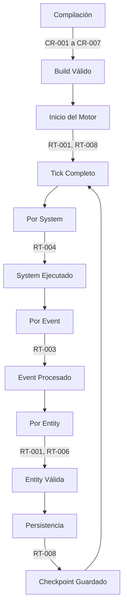

# 13. Reglas de Validación

**Versión**: 0.1  
**Estado**: Sprint 0 — Especificación  
**Última actualización**: 2026-07-26

---

## 1. Propósito

Este documento define todas las reglas de validación que el motor debe enforce. Las reglas están divididas en tres niveles:

- **Compile-time**: Reglas que el compilador C# puede verificar antes de ejecutar.
- **Runtime**: Reglas que se verifican durante la ejecución y generan errores/warnings.
- **Design-level**: Reglas que los desarrolladores deben seguir al crear nuevos componentes o sistemas.

---

## 2. Compile-Time Rules

### CR-001: System Phase Ordering

Todos los Systems deben declarar su fase de ejecución. La fase debe ser una de las definidas en `SystemPhase`.

```csharp
// VALID
[Order(SystemPhase.Initialization)]
public struct InitializeWorldSystem : ISystem { ... }

// INVALID
[Order(99)] // Error: fase no definida
public struct BadSystem : ISystem { ... }
```

### CR-002: Component Type Restriction

Los Components deben ser structs (no classes). Esto es enforceable por análisis estático o convention.

```csharp
// VALID
public struct PositionComponent { public float X, Y; }

// INVALID
public class PositionComponent { public float X, Y; } // Error: debe ser struct
```

### CR-003: Resource Type Restriction

Los Resources deben ser structs mutables (no inmutables, no classes).

```csharp
// VALID
public struct TimeResource { public float SimulationTime; }

// INVALID
public readonly struct TimeResource { ... } // Error: no puede ser readonly
public class TimeResource { ... } // Error: no puede ser class
```

### CR-004: System Descriptor Metadata

Todo System registrado debe tener un `SystemDescriptor` válido con:
- `Name`: no vacío, sin espacios
- `Version`: semver válido
- `Phase`: fase válida

### CR-005: Event Type Immutability

Los Events deben ser structs inmutables (readonly). No pueden tener campos mutables.

```csharp
// VALID
public readonly struct EntitySpawnedEvent { public readonly EntityId Id; }

// INVALID
public struct EntitySpawnedEvent { public EntityId Id; } // Warning: campo mutable
```

### CR-006: No Circular Dependencies

Los Systems no pueden tener dependencias circulares. El SystemManager debe rechazar cadenas de dependencia circulares.

### CR-007: Phase Transition Rules

Las fases deben ejecutarse en orden estricto:
```
Initialization → Perception → Cognition → Planning → Action → 
Consequences → Presentation → Shutdown
```

Ninguna fase puede saltarse ni ejecutarse fuera de orden.

---

## 3. Runtime Rules

### RT-001: World Integrity Check

Después de cada tick completo, el motor debe verificar:
- Todos los Entity IDs son válidos
- No hay Entity sin Components (excepto si fue explícitamente removida)
- Todos los Resources están inicializados
- El EventBus está vacío (no hay eventos sin flush)

### RT-002: Time Progression

El `TimeResource.SimulationTime` debe avanzar monótonamente. Nunca puede retroceder.

```csharp
// Si se detecta retroceso:
throw new TimeRegressionException(
    $"SimulationTime regresó de {_prevTime} a {time.SimulationTime}");
```

### RT-003: Event Bus Overflow Protection

El EventBus tiene un límite máximo de eventos por tick (por defecto 10,000). Si se supera:
- Registrar warning
- Descartar eventos excedentes
- Notificar al sistema de monitoreo

### RT-004: System Execution Timeout

Cada System tiene un timeout máximo de ejecución (por defecto 10ms). Si un System excede este tiempo:
- Registrar warning
- Continuar con el siguiente System
- Registrar el System como "lento" para análisis

### RT-005: Semantic State Generation Timeout

La generación del Semantic State tiene un timeout máximo (por defecto 50ms). Si se excede:
- Usar el último Semantic State válido
- Registrar warning
- Notificar al sistema de monitoreo

### RT-006: Memory Budget Enforcement

Cada Entity tiene un límite de memoria para sus Components (por defecto 64KB). Si se supera:
- Rechazar el Component adicional
- Registrar warning
- Sugerir dividir el Component

### RT-007: Relationship Integrity

Las Relationships deben ser bidireccionales. Si A tiene Relationship con B, B debe tener Relationship con A. Si se detecta inconsistencia:
- Registrar error
- Crear la Relationship faltante automáticamente
- Registrar el incidente para análisis

### RT-008: Persistence Checkpoint Frequency

El motor debe crear checkpoints de persistencia cada N ticks (por defecto 1000). Si el motor se cierra inesperadamente, puede recuperarse desde el último checkpoint.

### RT-009: LLM Response Validation

Las respuestas del LLM deben validarse contra un esquema. Si la respuesta es inválida:
- Reintentar una vez
- Si falla, usar respuesta de fallback
- Registrar el error para análisis

### RT-010: Entity Spawn Limits

El mundo tiene un límite máximo de Entitys concurrentes (por defecto 10,000). Si se intenta crear una Entity cuando se alcanza el límite:
- Rechazar el spawn
- Registrar warning
- Sugerir al jugador reducir la población

---

## 4. Design-Level Rules

### DL-001: System Single Responsibility

Cada System debe hacer exactamente una cosa. Si un System necesita hacer múltiples cosas, debe dividirse en múltiples Systems.

**Ejemplo**:
- `GrowthSystem` — solo maneja crecimiento de plantas
- `ReproductionSystem` — solo maneja reproducción
- `DeathSystem` — solo maneja muerte

No un `LifeCycleSystem` que haga todo.

### DL-002: Component Data Purity

Los Components solo contienen datos. No contienen lógica, no contienen referencias a otros Systems, no contienen callbacks.

```csharp
// VALID
public struct HealthComponent { public int Current; public int Max; }

// INVALID
public struct HealthComponent 
{ 
    public int Current; 
    public Action OnDeath; // Error: callback en Component
}
```

### DL-003: System Determinism

Los Systems deben ser deterministas. Dados los mismos Inputs y el mismo World State, deben producir los mismos Outputs. No deben depender de:
- Tiempo real
- Estado global mutable
- Random no sembrado

### DL-004: Event Naming Convention

Los Events deben seguir el patrón `{Entity}{PastTenseVerb}Event` o `{Action}Event`:

```csharp
// VALID
public struct EntitySpawnedEvent { ... }
public struct WeatherChangedEvent { ... }
public struct PlayerInputProcessedEvent { ... }

// INVALID
public struct Spawn { ... } // Error: nombre incompleto
public struct OnSpawn { ... } // Error: prefijo innecesario
```

### DL-005: Resource Global Access

Los Resources son accesibles por cualquier System. No deben usarse para comunicación privada entre Systems. Para comunicación privada, usar Events.

### DL-006: System Dependencies Documentation

Cada System debe documentar:
- Qué Resources necesita
- Qué Events escucha
- Qué Events emite
- Qué Components requiere

### DL-007: Semantic State Minimalism

El Semantic State debe contener el mínimo necesario para la narrativa. No debe incluir datos técnicos del ECS que el LLM no pueda interpretar.

### DL-008: Error Handling Strategy

Los Systems no deben catch excepciones silenciosamente. Las excepciones deben propagarse al SystemManager para logging y posible recuperación.

### DL-009: Testing Strategy

Cada System debe tener:
- Unit tests para la lógica core
- Integration tests con el World
- Performance benchmarks para Systems críticos

### DL-010: Documentation Requirements

Cada System, Component, Event, y Resource debe tener:
- XML documentation comments
- Ejemplo de uso
- Referencia a la documentación del motor

---

## 5. Validation Pipeline

El motor ejecuta validaciones en diferentes puntos:



---

## 6. Reglas de Validación para Desarrolladores

Al crear un nuevo System, seguir esta checklist:

- [ ] ¿El System está en la fase correcta?
- [ ] ¿El System tiene un SystemDescriptor válido?
- [ ] ¿El System es determinista?
- [ ] ¿El System no depende de estado global mutable?
- [ ] ¿El System tiene XML documentation?
- [ ] ¿El System tiene unit tests?
- [ ] ¿El System no excede el timeout de ejecución?
- [ ] ¿El System no viola la single responsibility?
- [ ] ¿El System documenta sus dependencias?

Al crear un nuevo Component:

- [ ] ¿El Component es un struct?
- [ ] ¿El Component solo contiene datos?
- [ ] ¿El Component no excede el memory budget?
- [ ] ¿El Component tiene XML documentation?

Al crear un nuevo Event:

- [ ] ¿El Event es un struct readonly?
- [ ] ¿El Event sigue la naming convention?
- [ ] ¿El Event es inmutable?
- [ ] ¿El Event tiene XML documentation?
